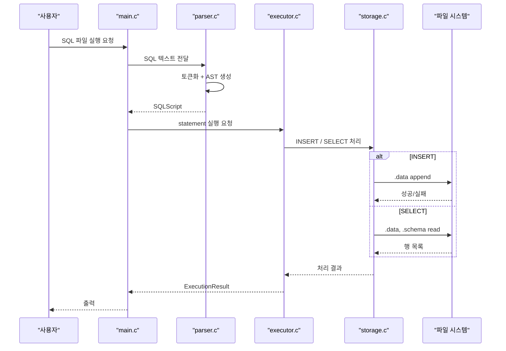
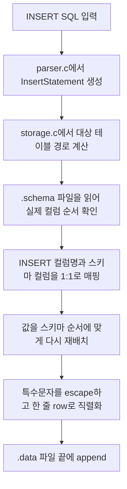
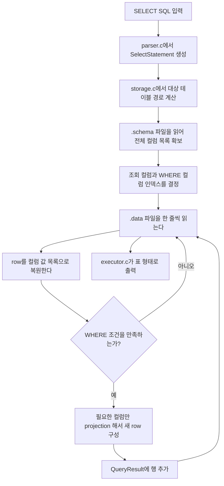

# wk06-mini-sql

간단한 파일 기반 mini SQL 실행기입니다. SQL 스크립트 파일을 읽어 `INSERT`/`SELECT`를 처리하고, 결과를 `.schema`/`.data` 파일로 저장합니다.

## 지원 기능

- `INSERT INTO [schema.]table (col1, col2, ...) VALUES (...)`
- `SELECT * FROM [schema.]table`
- `SELECT col1, col2 FROM [schema.]table`
- `WHERE column = value` (단일 조건만 지원)
- SQL 파일 주석
  - `-- line comment`
  - `/* block comment */`

예시:

```sql
INSERT INTO demo.students (id, name, major) VALUES (1, 'Alice', 'DB');
SELECT * FROM demo.students;
SELECT id, name FROM demo.students WHERE id = 1;
```

---

## 실행 파이프라인


---

## INSERT / SELECT 로직

파일 기반 DB이기 때문에 `INSERT`와 `SELECT`는 모두 `.schema`와 `.data` 파일을 기준으로 동작합니다.  
핵심은 `INSERT`는 "스키마 순서에 맞춰 한 줄을 추가"하는 과정이고, `SELECT`는 "스키마를 기준으로 컬럼 위치를 해석한 뒤 `.data`를 순회"하는 과정입니다.

### INSERT



INSERT 동작 단계:

1. `parser.c`가 `INSERT INTO ... VALUES ...`를 `InsertStatement`로 파싱합니다.
2. `storage.c`가 대상 테이블의 `.schema` / `.data` 경로를 계산합니다.
3. `.schema`를 읽어 실제 테이블 컬럼 순서를 확인합니다.
4. INSERT에 들어온 컬럼명을 스키마 컬럼과 매핑합니다.
5. 값을 스키마 순서대로 다시 정렬하고, 빠진 컬럼은 빈 문자열로 채웁니다.
6. `|`, `\`, 개행 같은 문자를 escape해서 한 줄 텍스트로 직렬화합니다.
7. 완성된 row를 `.data` 파일 끝에 추가합니다.

### SELECT



SELECT 동작 단계:

1. `parser.c`가 `SELECT ... FROM ... WHERE ...`를 `SelectStatement`로 파싱합니다.
2. `storage.c`가 `.schema`를 읽어 전체 컬럼 목록을 확보합니다.
3. `SELECT *`인지, 특정 컬럼만 조회하는지에 따라 projection 인덱스를 준비합니다.
4. `WHERE column = value`가 있으면 비교할 컬럼 인덱스를 먼저 찾습니다.
5. `.data` 파일을 한 줄씩 읽어 각 row를 다시 컬럼 값 목록으로 복원합니다.
6. WHERE 조건을 통과한 row만 선택합니다.
7. 필요한 컬럼만 뽑아 `QueryResult`에 누적합니다.
8. 마지막에 `executor.c`가 결과를 테이블 형식으로 출력합니다.

---

## 파일 입출력

### 파일 구성

- `.schema`
  - 컬럼 메타데이터 저장
  - 컬럼 순서 보존
- `.data`
  - 실제 row 데이터 저장
  - 한 줄 = 한 row

### Ex. `demo.students` 테이블

```text
db_root/
  demo
  |_ students.schema
  |_ students.data
```

### Ex. schema 없이 바로 쓰는 경우

```text
db_root/
  |_ students.schema
  |_ students.data
```

### `.schema`

- 저장 형식: `|` 구분 텍스트
- 의미: 컬럼 순서 정의

```text
id|name|major|grade
```

### `.data`

- 저장 형식: `|` 구분 텍스트
- 의미: 실제 row 데이터
- 규칙: 한 줄 = 한 row

```text
1|Alice|Database|A
2|Bob|AI|B
```

### 파일 입출력에 사용한 함수

#### `src/common.c`

- `read_text_file()`
  - 텍스트 파일 전체 읽기
- `write_text_file()`
  - 파일 새로 쓰기 / 초기화
- `append_text_file()`
  - `.data` 끝에 row 추가
- `ensure_parent_directory()`
  - 상위 디렉터리 생성 보장

#### `src/storage.c`

- `build_table_paths()`
  - `[schema.]table` -> `.schema` / `.data` 경로 변환
- `load_table_definition()`
  - `.schema` 로드
  - 컬럼 순서 복원
- `serialize_row()`
  - INSERT row 직렬화
- `split_pipe_line()`
  - `.data` 한 줄 복원
- `append_insert_row()`
  - INSERT 결과를 `.data`에 기록
- `run_select_query()`
  - `.schema` / `.data` 기반 SELECT 수행

### 정리

- 테이블 단위 저장: `.schema` + `.data`
- INSERT: row 직렬화 후 `.data` append
- SELECT: `.schema` / `.data` 읽기 후 결과 복원

---

## 시연 내용

### 사용 파일

- DB 경로: `examples/db`
- SQL 파일: `examples/sql/demo_workflow.sql`

### 시연 순서

1. `demo.students` 테이블에 `INSERT` 2회 실행
2. `SELECT *` 결과 확인
3. `WHERE id = 2` 결과 확인

### 시연 SQL

```sql
INSERT INTO demo.students (id, name, major, grade) VALUES (2, 'Bob', 'AI', 'B');
INSERT INTO demo.students (id, name, major, grade) VALUES (3, 'Choi', 'Data', 'A');
SELECT * FROM demo.students;
SELECT name, grade FROM demo.students WHERE id = 2;
```

### 확인 포인트

- INSERT 결과가 실제 `.data` 파일에 row로 저장되는지
- SELECT가 `.schema` 기준으로 컬럼 순서를 해석하는지
- WHERE 조건으로 필요한 row만 필터링되는지
- `executor.c`가 최종 결과를 표 형태로 출력하는지

---

## 빌드/실행/테스트

### 빌드

```powershell
.\scripts\build.ps1
```

출력:
- `build\mini_sql.exe`
- `build\test_runner.exe`

### 실행(데모)

```powershell
.\scripts\demo.ps1
```

직접 실행:

```powershell
.\build\mini_sql.exe examples\db examples\sql\demo_workflow.sql
```

또는

```powershell
.\build\mini_sql.exe --db examples\db --file examples\sql\demo_workflow.sql
```

### 테스트

```powershell
.\scripts\test.ps1
```

실행 대상:
- `tests\test_runner.c` 정적 테스트
- `scripts\test.ps1` 통합 테스트

---

## 프로젝트 트리

```text
.
+ include/
  - common.h
  - executor.h
  - parser.h    
  - storage.h
+ src/
  - common.c
  - executor.c
  - parser.c
  - storage.c
  - main.c
+ tests/
  - test_runner.c
+ scripts/
  - build.ps1
  - demo.ps1
  - test.ps1
+ examples/
  - db/
  - sql/
```

---
