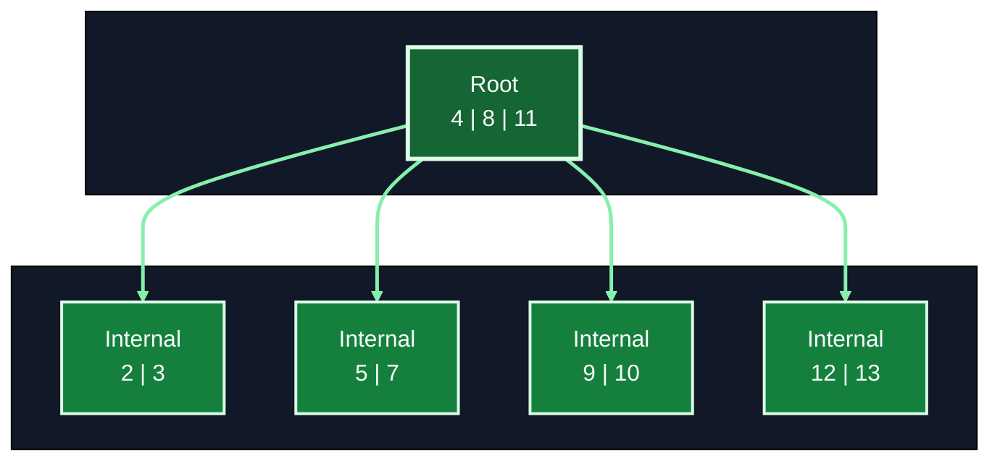
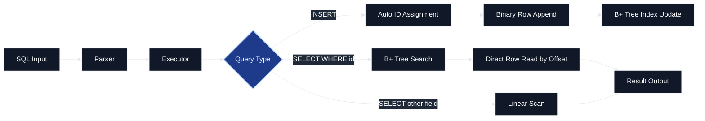
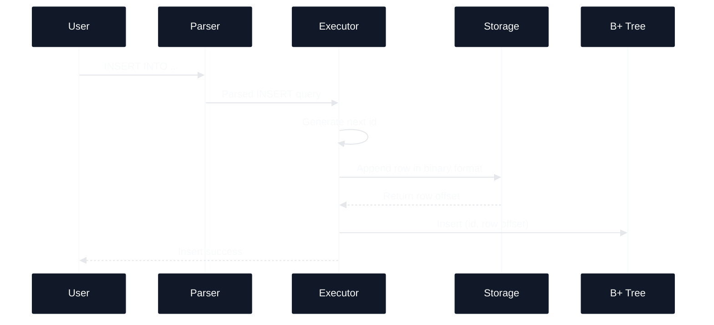
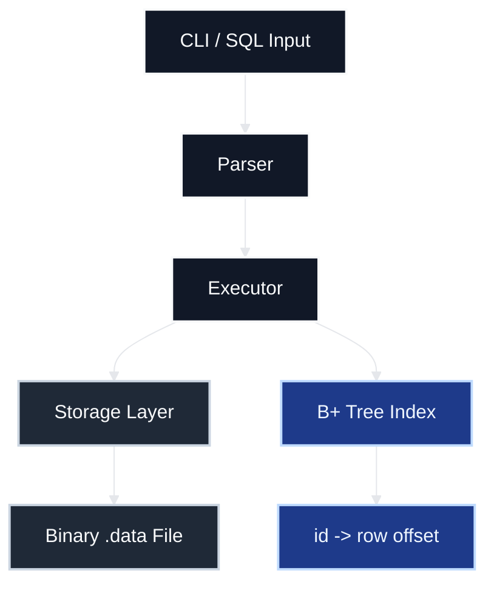
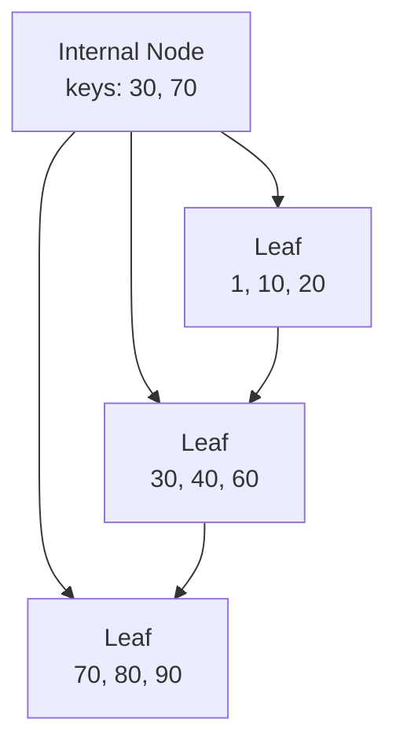

# B+ Tree Index Mini SQL

- 기존 Mini SQL 처리기ì—� `?�ë�™ ID`, `ë°”ì�´?ˆë¦¬ ?€??, `메모ë¦?기반 B+ Tree ?¸ë�±??ë¥?ê²°í•©???„ë¡œ?�트
- `WHERE id = ?` ë°?`WHERE id` 범위 ì¡°ê±´???¸ë�±??경로ë¡?처리
- 비ì�¸?±ìŠ¤ ì¡°ê±´?€ ? í˜• ?�색?¼ë¡œ 처리
- 1,000,000ê±??´ìƒ� ?°ì�´??기ì? ?±ëŠ¥ 비êµ� ?˜í–‰

## 1. ?œë¹„??

### 1-1. ??ì¤??¤ëª…

- `INSERT` ???�ë�™?¼ë¡œ IDë¥?부?¬í•˜ë©??´ë‹¹ IDë¥?B+ Tree ?¸ë�±?¤ì—� ?±ë¡�??`WHERE id = ?` 조회ë¥?빠르ê²?처리?˜ëŠ” Mini SQL ?”진

### 1-2. ?„ë¡œ?�트 목표

- 기존 SQL 처리기ì�˜ ? í˜• ?�색 기반 조회 구조 ?•ì�¥
- `WHERE id = ?` ì¡°ê±´?�ì„œ ?¸ë�±???¬ìš© ê°€?¥í•˜?„ë¡� 개선
- ?€?©ëŸ‰ ?°ì�´?°ì—�???¸ë�±??조회?€ ? í˜• ?�색??ì°¨ì�´ ê²€ì¦?
- 기존 SQL 처리기ì? ?¸ë�±??구조???�ì—°?¤ëŸ¬???°ê²°

### 1-3. 지??기능

- `INSERT`
- `SELECT *`
- `SELECT ... WHERE id = ?`
- `SELECT ... WHERE id > ?`, `>= ?`, `< ?`, `<= ?`
- `SELECT ... WHERE major = ?` ??비ì�¸?±ìŠ¤ ì¡°ê±´ 조회
- CLI 기반 SQL ?…ë ¥ ë°??¤í–‰
- ?€???°ì�´???½ì�… ë°??±ëŠ¥ 측정

### 1-4. ?°ì�´???€??구조

- ë°”ì�´?ˆë¦¬ row ?¬ë§· ?¬ìš©
- ê°?rowë¥??Œì�¼ ??`row offset`?¼ë¡œ ì§�ì ‘ ?‘ê·¼
- B+ Tree??`id -> row offset` 매핑 ? ì?
- ?¸ë�±??조회 ???Œì�¼ ?„ì²´ë¥??œíšŒ?˜ì? ?Šê³  row ?„치ë¡?ì§�ì ‘ ?´ë�™

?¨ìˆœ B+ Tree 구조

```mermaid
%%{init: {
  "theme": "base",
  "themeVariables": {
    "background": "#0b1020",
    "primaryColor": "#111827",
    "primaryTextColor": "#f9fafb",
    "primaryBorderColor": "#f9fafb",
    "lineColor": "#e5e7eb",
    "secondaryColor": "#1f2937",
    "secondaryTextColor": "#f9fafb",
    "tertiaryColor": "#111827",
    "tertiaryTextColor": "#f9fafb"
  }
}}%%
flowchart LR
    A1["1 | 2"] --> A2["3"] --> B1["4 | 5"] --> B2["7"] --> C1["8 | 9"] --> C2["10"] --> D1["11 | 12"] --> D2["13 | 14 | 15"]

    classDef leaf fill:#22c55e,stroke:#dcfce7,stroke-width:2px,color:#052e16;
    linkStyle 0,1,2,3,4,5,6 stroke:#bbf7d0,stroke-width:2px;
    class A1,A2,B1,B2,C1,C2,D1,D2 leaf;
```





Leaf -> Binary Row 매핑

```mermaid
%%{init: {
  "theme": "base",
  "themeVariables": {
    "background": "#0b1020",
    "primaryColor": "#111827",
    "primaryTextColor": "#f9fafb",
    "primaryBorderColor": "#f9fafb",
    "lineColor": "#e5e7eb",
    "secondaryColor": "#1f2937",
    "secondaryTextColor": "#f9fafb",
    "tertiaryColor": "#111827",
    "tertiaryTextColor": "#f9fafb"
  }
}}%%
flowchart TD
    subgraph OffsetLevel[" "]
        direction LR
        O1["0x10"]
        O2["0x20"]
        O3["0x30"]
        O4["0x40"]
        O5["0x50"]
        O7["0x70"]
        O8["0x80"]
        O9["0x90"]
        O10["0xA0"]
        O11["0xB0"]
        O12["0xC0"]
        O13["0xD0"]
        O14["0xE0"]
        O15["0xF0"]
    end

    subgraph RowLevel[" "]
        direction LR
        D1["0x10<br/>id=1<br/>name=Kim<br/>major=CS"]
        D2["0x20<br/>id=2<br/>name=Lee<br/>major=Math"]
        D3["0x30<br/>id=3<br/>name=Park<br/>major=Physics"]
        D4["0x40<br/>id=4<br/>name=Choi<br/>major=CS"]
        D5["0x50<br/>id=5<br/>name=Jung<br/>major=Biology"]
        D7["0x70<br/>id=7<br/>name=Han<br/>major=Economics"]
        D8["0x80<br/>id=8<br/>name=Lim<br/>major=CS"]
        D9["0x90<br/>id=9<br/>name=Kang<br/>major=Math"]
        D10["0xA0<br/>id=10<br/>name=Yoon<br/>major=Design"]
        D11["0xB0<br/>id=11<br/>name=Seo<br/>major=CS"]
        D12["0xC0<br/>id=12<br/>name=Shin<br/>major=Chemistry"]
        D13["0xD0<br/>id=13<br/>name=Hwang<br/>major=History"]
        D14["0xE0<br/>id=14<br/>name=Oh<br/>major=Math"]
        D15["0xF0<br/>id=15<br/>name=Song<br/>major=CS"]
    end

    O1 -.-> D1
    O2 -.-> D2
    O3 -.-> D3
    O4 -.-> D4
    O5 -.-> D5
    O7 -.-> D7
    O8 -.-> D8
    O9 -.-> D9
    O10 -.-> D10
    O11 -.-> D11
    O12 -.-> D12
    O13 -.-> D13
    O14 -.-> D14
    O15 -.-> D15

    classDef offset fill:#111827,stroke:#cbd5e1,stroke-width:2px,color:#f9fafb;
    classDef data fill:#374151,stroke:#d1d5db,stroke-width:2px,color:#f9fafb;
    linkStyle 0,1,2,3,4,5,6,7,8,9,10,11,12,13 stroke:#d1d5db,stroke-width:2px,stroke-dasharray: 4 4;
    class O1,O2,O3,O4,O5,O7,O8,O9,O10,O11,O12,O13,O14,O15 offset;
    class D1,D2,D3,D4,D5,D7,D8,D9,D10,D11,D12,D13,D14,D15 data;
```



## 2. ?Œì�´?„ë�¼??

### 2-1. ?„ì²´ 처리 ?�름



### 2-2. INSERT ?Œì�´?„ë�¼??

- SQL ?…ë ¥
- Parser?�ì„œ INSERT 구문 ?´ì„�
- Executor?�ì„œ ?¤ì�Œ ID ?�성
- Storage??ë°”ì�´?ˆë¦¬ row append
- append 결과�`row offset` ?��
- B+ Tree??`(id, row offset)` ?±ë¡�



### 2-3. SELECT ?Œì�´?„ë�¼??

- `WHERE id = ?` ?�는 `WHERE id` 범위 ì¡°ê±´?€ B+ Tree ?¸ë�±??경로 ?¬ìš©
- ?¸ë�±??경로??B+ Tree?�ì„œ row offset ?�색 ??offset 기반 direct read ?˜í–‰
- `WHERE major = ?` ê°™ì? 비ì�¸?±ìŠ¤ ì¡°ê±´?€ B+ Treeë¥?거치지 ?Šì�Œ
- 비ì�¸?±ìŠ¤ 경로???„ì²´ rowë¥?? í˜• ?�색?˜ë©° ì¡°ê±´ 비êµ� ?˜í–‰

```mermaid
%%{init: {
  "theme": "base",
  "themeVariables": {
    "background": "#0b1020",
    "primaryColor": "#111827",
    "primaryTextColor": "#f9fafb",
    "primaryBorderColor": "#f9fafb",
    "lineColor": "#e5e7eb",
    "secondaryColor": "#1f2937",
    "secondaryTextColor": "#f9fafb",
    "tertiaryColor": "#111827",
    "tertiaryTextColor": "#f9fafb",
    "actorBkg": "#111827",
    "actorBorder": "#f9fafb",
    "actorTextColor": "#f9fafb",
    "signalColor": "#e5e7eb",
    "signalTextColor": "#f9fafb",
    "labelBoxBkgColor": "#111827",
    "labelBoxBorderColor": "#f9fafb",
    "labelTextColor": "#f9fafb",
    "loopTextColor": "#f9fafb",
    "noteBkgColor": "#1f2937",
    "noteBorderColor": "#f9fafb",
    "noteTextColor": "#f9fafb",
    "activationBorderColor": "#f9fafb",
    "activationBkgColor": "#166534"
  }
}}%%
sequenceDiagram
    participant U as User
    participant P as Parser
    participant E as Executor
    participant B as B+ Tree Index
    participant S as Storage

    rect rgb(17, 24, 39)
        Note over U,S: Indexed path: WHERE id = ? / WHERE id range
        U->>P: SELECT ... WHERE id ...
        P->>E: Parsed SELECT query
        E->>E: Detect id predicate
        E->>B: Search id / range
        B-->>E: row offset(s)
        E->>S: Read row(s) by offset
        S-->>E: row data
        E-->>U: Query result
    end

    rect rgb(31, 41, 55)
        Note over U,S: Non-indexed path: WHERE major = ? and other fields
        U->>P: SELECT ... WHERE major ...
        P->>E: Parsed SELECT query
        E->>E: Detect non-id predicate
        E->>S: Scan all rows
        S-->>E: matched rows
        E-->>U: Query result
    end
```



## 3. ?µì‹¬ 구현 ?´ìš©

- 발표 ?œê°„??짧ì�„ 경우 ?´ë¡  ?¤ëª… 중심?¼ë¡œ 진행
- ?œê°„???¨ì�„ 경우 코드 ?ˆë²¨ ?¬ì�¸?¸ê¹Œì§€ ?•ì�¥ ?¤ëª…

### 3-1. INSERT ???�ë�™ ID ?�성 ë°??¸ë�±???±ë¡�

#### ?´ë¡ 

- `INSERT` ?¤í–‰ ???¤ì�Œ ID ?�ë�™ ?�성
- ?�성??IDë¥??¬í•¨??rowë¥?ë°”ì�´?ˆë¦¬ ?¬ë§·?¼ë¡œ ?€??
- ?€??ì§�후 row ?œì�‘ ?„치??`row offset` ?•ë³´
- `(id, row offset)`ë¥?B+ Tree??즉시 ?±ë¡�

#### 코드 ?ˆë²¨ ?¬ì�¸??

- `execute_statement()`?�ì„œ `INSERT` 문ì�„ `append_insert_row()`ë¡??°ê²°
- `next_id()`가 ?�� ID�?�성
- `binary_writer_append_row()`ê°€ ë°”ì�´?ˆë¦¬ rowë¥?append?˜ê³  `row offset`??반환
- `index_insert()`ê°€ `(id, row offset)`ë¥??¸ë�±?¤ì—� ?±ë¡�
- ?¤ì œ B+ Tree ?½ì�…?€ `bpt_insert_recursive()`ê°€ ?˜í–‰

### 3-2. ?¸ë�±??경로?€ ? í˜• ?�색 경로 분리

#### ?´ë¡ 

- `WHERE id = ?`??B+ Tree ?¸ë�±???¬ìš©
- `WHERE id >= ?`, `<= ?` ??범위 ì¡°ê±´?€ leaf ?œíšŒ ?¬ìš©
- `WHERE major = ?` ê°™ì? ì¡°ê±´?€ ? í˜• ?�색 ?¬ìš©
- ì¡°ê±´ 종류???°ë�¼ ?¤í–‰ 경로ë¥?분기

#### 코드 ?ˆë²¨ ?¬ì�¸??

- `execute_statement()`?�ì„œ `SELECT` 문ì�„ `run_select_query()`ë¡??°ê²°
- `run_select_query()`가 `is_id_equality_predicate()` / `is_id_range_predicate()`�분기
- ?¨ê±´ ID 조회??`run_select_by_id()` -> `index_find()` -> `bpt_find()` 경로 ?¬ìš©
- 범위 ID 조회??`run_select_by_id_range()` -> `bpt_lower_bound()` 경로 ?¬ìš©
- ?¸ë�±??조회 ?´í›„ ?¤ì œ row ?½ê¸°??`binary_reader_read_row_at()`ê°€ ?˜í–‰
- 비ì�¸?±ìŠ¤ ì¡°ê±´?€ `run_select_linear()` -> `binary_reader_scan_all()` 경로 ?¬ìš©

### 3-3. B+ Tree ?¸ë“œ 구성 ë°©ì‹�

#### ?´ë¡ 

- ?´ë? ?¸ë“œ??key?€ child pointer 보유
- 리프 ?¸ë“œ??key?€ value(`row offset`) 보유
- 리프 ?¸ë“œ ê°??°ê²°???µí•´ 범위 조회 지??
- ?¸ë“œê°€ ê°€??차면 split ?˜í–‰
- split ê²°ê³¼ë¥?부ëª??¸ë“œ??ë°˜ì˜�

#### ì»´í�¬?ŒíŠ¸ ?¤ì�´?´ê·¸??



#### B+ Tree 구조 ?ˆì‹œ



#### 코드 ?ˆë²¨ ?¬ì�¸??

- `BptNode` 구조체ê? internal / leaf ?¸ë“œ ?•íƒœë¥??¨ê»˜ ?•ì�˜
- `bpt_insert_recursive()`ê°€ leaf ?½ì�…ê³?internal ?½ì�…??모ë‘� 처리
- leaf split ???¤ë¥¸ìª??¸ë“œ??ì²?keyë¥?부모로 ?¹ê²©
- internal split ??중간 keyë¥?부모로 ?¹ê²©
- `bpt_find()`ê°€ equality query ?�색???´ë‹¹
- `bpt_lower_bound()`ê°€ range query ?œì�‘ leafë¥?ì°¾ì�Œ

## 4. ?ϓѡ

### 4-1. CLI 기능 ?œì—°

?œì—° ?œì„œ
1. `INSERT`ë¡??ˆì½”??추ê?
2. `SELECT *`ë¡??„ì²´ ?°ì�´???•ì�¸
3. `WHERE id = ?`ë¡??¨ê±´ ?¸ë�±??조회
4. `WHERE id >= ?` ?�는 `WHERE id <= ?`�범위 조회
5. `WHERE major = ?`ë¡?비ì�¸?±ìŠ¤ ì¡°ê±´ 조회

?ˆì‹œ SQL

```sql
INSERT INTO demo.students (name, major, grade) VALUES ("Kim", "CS", "3");
INSERT INTO demo.students (name, major, grade) VALUES ("Lee", "Math", "2");

SELECT * FROM demo.students;
SELECT name, major FROM demo.students WHERE id = 1;
SELECT * FROM demo.students WHERE id >= 1;
SELECT * FROM demo.students WHERE major = "CS";
```

### 4-2. CLI ?ˆì™¸ 처리

- ì¡´ì�¬?˜ì? ?ŠëŠ” ID 조회
- ?˜ëª»??ì¡°ê±´???…ë ¥
- 지?�하지 ?ŠëŠ” SQL ?•ì‹� ?…ë ¥

### 4-3. 100ë§?ê±??°ì�´??기반 ?±ëŠ¥ 비êµ�

- ?°ì�´???? `1,000,000`ê±??´ìƒ�
- 비êµ� A: `WHERE id = ?` -> B+ Tree ?¸ë�±???¬ìš©
- 비êµ� B: `WHERE major = ?` -> ? í˜• ?�색 ?¬ìš©
- ?¸ë�±??경로?€ ? í˜• ?�색 경로???¤í–‰ ?œê°„ 비êµ�

#### 측정 ?ˆì‹œ ê²°ê³¼

| ??ª© | ?¤í–‰ ?œê°„ | ?‘ê·¼ 경로 |
| --- | ---: | --- |
| `WHERE id = ?` | 540 ms | B+ Tree Index |
| `WHERE major = ?` | 958 ms | Linear Scan |

#### ?´ì„� ?¬ì�¸??

- `WHERE id = ?`??row ?„치ë¥?ì§�ì ‘ 찾기 ?Œë¬¸??조회 비용???‘ì�Œ
- `WHERE major = ?`???„ì²´ row 비êµ�ê°€ ?„ìš”??비용????
- ?™ì�¼??SELECT?¼ë�„ ì¡°ê±´???°ë�¼ ?¤í–‰ 경로가 ?¬ë�¼ì§?

## 5. ?ŒìŠ¤??

### 5-1. ?¨ìœ„ ?ŒìŠ¤??

- B+ Tree ?½ì�… ê²€ì¦?
- key 검??검�
- 범위 검??검�
- ?¸ë“œ 분할 ?´í›„ ê²€???•í™•??ê²€ì¦?
- ì¡´ì�¬?˜ì? ?ŠëŠ” key 조회 ê²€ì¦?

### 5-2. 기능 ?ŒìŠ¤??

- `INSERT` ???�ë�™ ID ì¦�ê? ê²€ì¦?
- `SELECT *` 결과 검�
- `WHERE id = ?` ?™ì�‘ ê²€ì¦?
- `WHERE id` 범위 ì¡°ê±´ ?™ì�‘ ê²€ì¦?
- `WHERE major = ?` ? í˜• ?�색 ?™ì�‘ ê²€ì¦?

### 5-3. ?µí•© ê´€??ê²€ì¦?

- SQL ?…력부???Œì‹±, ?¤í–‰, ?€?? 조회까ì? ?„ì²´ ?�름 ê²€ì¦?
- ë°”ì�´?ˆë¦¬ ?€??구조 ?„환 ?´í›„ ê²°ê³¼ ?¼ê???ê²€ì¦?
- ?¸ë�±??경로?€ 비ì�¸?±ìŠ¤ 경로??분기 ?™ì�‘ ê²€ì¦?

## 6. ?Œê°�

- 추후 ?‘성 ?ˆì •
