# B+ Tree Index Mini SQL

- 기존 "바이너리 데이터 구조"의 Mini SQL 처리기
- B+ Tree를 적용해 조회 속도 향상

## 1. 서비스

### 1-1. 한 줄 설명

- `INSERT` 시 자동으로 ID를 부여하면 해당 ID를 B+ Tree 인덱스에 등록해 `WHERE id = ?` 조회를 빠르게 처리하는 Mini SQL 엔진

### 1-2. 프로젝트 목표

- 기존 SQL 처리기의 선형 탐색 기반 조회 구조 확장
- `WHERE id = ?` 조건에서 인덱스 사용 가능하도록 개선
- 대용량 데이터에서 인덱스 조회와 선형 탐색의 차이 검증
- 기존 SQL 처리기와 인덱스 구조의 자연스러운 연결

### 1-3. 지원 기능

- `INSERT`
- `SELECT *`
- `SELECT ... WHERE id = ?`
- `SELECT ... WHERE id > ?`, `>= ?`, `< ?`, `<= ?`
- `SELECT ... WHERE major = ?` 등 비인덱스 조건 조회
- CLI 기반 SQL 입력 및 실행
- 대량 데이터 삽입 및 성능 측정

### 1-4. 데이터 저장 구조

- 바이너리 row 포맷 사용
- 각 row를 파일 내 `row offset`으로 직접 접근
- B+ Tree는 `id -> row offset` 매핑 유지
- 인덱스 조회 시 파일 전체를 순회하지 않고 row 위치로 직접 이동

단순 B+ Tree 구조

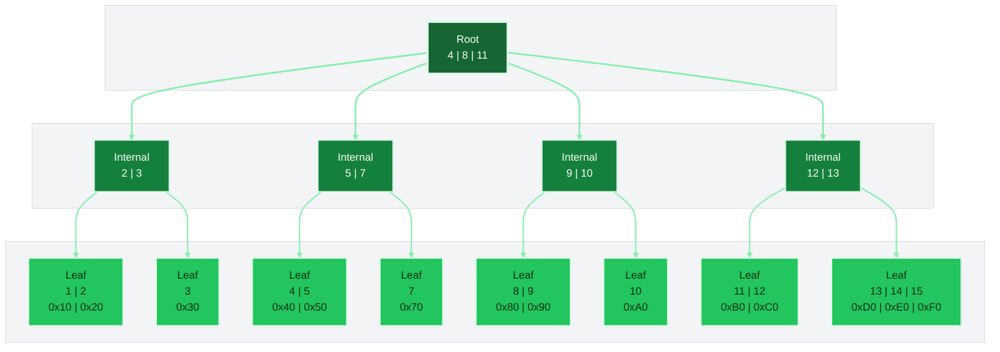

```mermaid
%%{init: {
  "theme": "base",
  "themeVariables": {
    "background": "#0b1020",
    "primaryColor": "#111827",
    "primaryTextColor": "#f9fafb",
    "primaryBorderColor": "#f9fafb",
    "lineColor": "#e5e7eb",
    "secondaryColor": "#1f2937",
    "secondaryTextColor": "#f9fafb",
    "tertiaryColor": "#111827",
    "tertiaryTextColor": "#f9fafb"
  }
}}%%
flowchart LR
    A1["1 | 2<br/>0x10 | 0x20"] --> A2["3<br/>0x30"] --> B1["4 | 5<br/>0x40 | 0x50"] --> B2["7<br/>0x70"] --> C1["8 | 9<br/>0x80 | 0x90"] --> C2["10<br/>0xA0"] --> D1["11 | 12<br/>0xB0 | 0xC0"] --> D2["13 | 14 | 15<br/>0xD0 | 0xE0 | 0xF0"]

    classDef leaf fill:#22c55e,stroke:#dcfce7,stroke-width:2px,color:#052e16;
    linkStyle 0,1,2,3,4,5,6 stroke:#bbf7d0,stroke-width:2px;
    class A1,A2,B1,B2,C1,C2,D1,D2 leaf;
```

Leaf -> Binary Row 매핑

```mermaid
%%{init: {
  "theme": "base",
  "themeVariables": {
    "background": "#ffffff",
    "primaryColor": "#f8fafc",
    "primaryTextColor": "#111827",
    "primaryBorderColor": "#334155",
    "lineColor": "#475569",
    "secondaryColor": "#f1f5f9",
    "secondaryTextColor": "#111827",
    "tertiaryColor": "#e2e8f0",
    "tertiaryTextColor": "#111827"
  }
}}%%
flowchart TD
    subgraph OffsetLevel[" "]
        direction LR
        O1["0x10"]
        O2["0x20"]
        O3["0x30"]
        O4["0x40"]
        O5["0x50"]
        O7["0x70"]
        O8["0x80"]
        O9["0x90"]
        O10["0xA0"]
        O11["0xB0"]
        O12["0xC0"]
        O13["0xD0"]
        O14["0xE0"]
        O15["0xF0"]
    end

    subgraph RowLevel[" "]
        direction LR
        D1["0x10<br/>id=1<br/>name=Kim<br/>major=CS"]
        D2["0x20<br/>id=2<br/>name=Lee<br/>major=Math"]
        D3["0x30<br/>id=3<br/>name=Park<br/>major=Physics"]
        D4["0x40<br/>id=4<br/>name=Choi<br/>major=CS"]
        D5["0x50<br/>id=5<br/>name=Jung<br/>major=Biology"]
        D7["0x70<br/>id=7<br/>name=Han<br/>major=Economics"]
        D8["0x80<br/>id=8<br/>name=Lim<br/>major=CS"]
        D9["0x90<br/>id=9<br/>name=Kang<br/>major=Math"]
        D10["0xA0<br/>id=10<br/>name=Yoon<br/>major=Design"]
        D11["0xB0<br/>id=11<br/>name=Seo<br/>major=CS"]
        D12["0xC0<br/>id=12<br/>name=Shin<br/>major=Chemistry"]
        D13["0xD0<br/>id=13<br/>name=Hwang<br/>major=History"]
        D14["0xE0<br/>id=14<br/>name=Oh<br/>major=Math"]
        D15["0xF0<br/>id=15<br/>name=Song<br/>major=CS"]
    end

    O1 -.-> D1
    O2 -.-> D2
    O3 -.-> D3
    O4 -.-> D4
    O5 -.-> D5
    O7 -.-> D7
    O8 -.-> D8
    O9 -.-> D9
    O10 -.-> D10
    O11 -.-> D11
    O12 -.-> D12
    O13 -.-> D13
    O14 -.-> D14
    O15 -.-> D15

    classDef offset fill:#ffffff,stroke:#334155,stroke-width:2px,color:#111111;
    classDef data fill:#f3f4f6,stroke:#334155,stroke-width:2px,color:#111111;
    linkStyle 0,1,2,3,4,5,6,7,8,9,10,11,12,13 stroke:#d1d5db,stroke-width:2px,stroke-dasharray: 4 4;
    class O1,O2,O3,O4,O5,O7,O8,O9,O10,O11,O12,O13,O14,O15 offset;
    class D1,D2,D3,D4,D5,D7,D8,D9,D10,D11,D12,D13,D14,D15 data;
```

## 2. B+ Tree 인덱스 구조

### 2-1. 왜 B+ Tree를 사용했는가

- `WHERE id = ?` 조건을 선형 탐색 없이 빠르게 처리하기 위해 도입
- 레코드 저장 위치를 `id -> row offset` 형태로 관리
- equality query와 range query를 모두 처리 가능
- 기존 SQL 처리기에 자연스럽게 연결할 수 있는 인덱스 구조

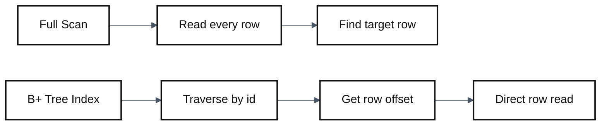

### 2-2. B+ Tree는 어떻게 생겼는가

- Root / Internal / Leaf 계층 구조
- Internal node는 탐색 경로를 분기
- Leaf node는 `(id, row offset)` 쌍을 저장
- Leaf node끼리 연결되어 범위 조회를 처리

예시 스키마는 `demo.students(id, name, major, grade)`를 기준으로 설명합니다.

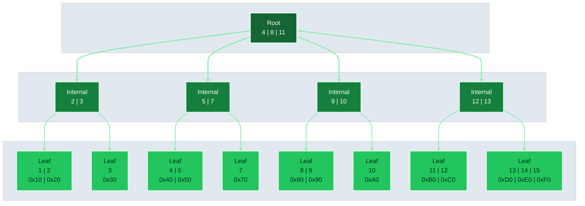

### 2-3. B+ Tree는 어떻게 생성되는가

- 테이블 초기화 시 인덱스 구조 생성
- 기존 바이너리 row가 있으면 전체를 읽으며 인덱스 rebuild
- 각 row의 `id`와 `offset`을 B+ Tree에 등록
- 가장 큰 ID를 기준으로 다음 자동 ID를 준비

```mermaid
%%{init: {
  "theme": "base",
  "themeVariables": {
    "background": "#ffffff",
    "primaryColor": "#f8fafc",
    "primaryTextColor": "#111827",
    "primaryBorderColor": "#334155",
    "lineColor": "#475569",
    "secondaryColor": "#f1f5f9",
    "secondaryTextColor": "#111827",
    "tertiaryColor": "#e2e8f0",
    "tertiaryTextColor": "#111827"
  }
}}%%
flowchart LR
    A["Load table"] --> B["index_init()"]
    B --> C["binary_reader_scan_all()"]
    C --> D["build_index_callback()"]
    D --> E["Insert (id, offset) into B+ Tree"]
    E --> F["Set next auto ID"]

    classDef box fill:#ffffff,stroke:#111111,stroke-width:2px,color:#111111;
    class A,B,C,D,E,F box;
```

### 2-4. INSERT 시 노드는 어떻게 추가되는가

- `INSERT` 요청이 들어오면 다음 ID를 생성
- 새로운 row를 바이너리 파일에 append
- append된 row의 offset을 얻음
- `(id, offset)`을 leaf node에 삽입
- 노드가 가득 차면 split하고 부모로 키를 전파

```mermaid
%%{init: {
  "theme": "base",
  "themeVariables": {
    "background": "#ffffff",
    "primaryColor": "#ffffff",
    "primaryTextColor": "#111111",
    "primaryBorderColor": "#111111",
    "lineColor": "#111111",
    "secondaryColor": "#f3f4f6",
    "secondaryTextColor": "#111111",
    "tertiaryColor": "#e5e7eb",
    "tertiaryTextColor": "#111111"
  }
}}%%
flowchart LR
    A["Client<br/>INSERT INTO demo.students ..."] --> B["Executor<br/>next_id()"]
    B --> C["Storage<br/>binary_writer_append_row()"]
    C --> D["Executor<br/>row offset"]
    D --> E["Index<br/>index_insert(id, offset)"]
    E --> F["B+ Tree<br/>bpt_insert_recursive()"]
    F --> G["Executor<br/>done"]

    classDef box fill:#ffffff,stroke:#111111,stroke-width:2px,color:#111111;
    class A,B,C,D,E,F,G box;
```

### 2-5. 단건 조회는 어떻게 동작하는가

- `WHERE id = ?`면 root부터 시작해 leaf까지 내려감
- leaf에서 일치하는 ID를 찾고 offset을 확인
- 해당 offset으로 바이너리 row를 직접 읽음
- `WHERE student_no = ?`, `WHERE major = ?` 같은 조건은 인덱스를 사용하지 않음

```mermaid
%%{init: {
  "theme": "base",
  "themeVariables": {
    "background": "#ffffff",
    "primaryColor": "#f8fafc",
    "primaryTextColor": "#111827",
    "primaryBorderColor": "#334155",
    "lineColor": "#475569",
    "secondaryColor": "#f1f5f9",
    "secondaryTextColor": "#111827",
    "tertiaryColor": "#e2e8f0",
    "tertiaryTextColor": "#111827"
  }
}}%%
flowchart LR
    A["SELECT * FROM demo.students WHERE id = 8"] --> B["Root"]
    B --> C["Internal"]
    C --> D["Leaf: id=8, offset=0x80"]
    D --> E["binary_reader_read_row_at(0x80)"]
    E --> F["Return row: (8, Lim, CS, ...)"]

    classDef box fill:#ffffff,stroke:#111111,stroke-width:2px,color:#111111;
    classDef leaf fill:#22c55e,stroke:#166534,stroke-width:2px,color:#052e16;
    class A,B,C,E,F box;
    class D leaf;
```

### 2-6. 범위 조회는 어떻게 동작하는가

- `WHERE id >= ?`, `<= ?`는 lower bound가 되는 leaf를 먼저 찾음
- 시작 leaf를 찾은 뒤 leaf chain을 따라가며 범위를 읽음
- 범위가 커질수록 leaf 순회가 이어지지만, full scan보다 훨씬 적은 row를 읽을 수 있음

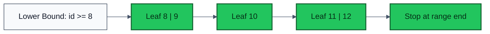

## 3. 파이프라인

### 3-1. 전체 처리 흐름

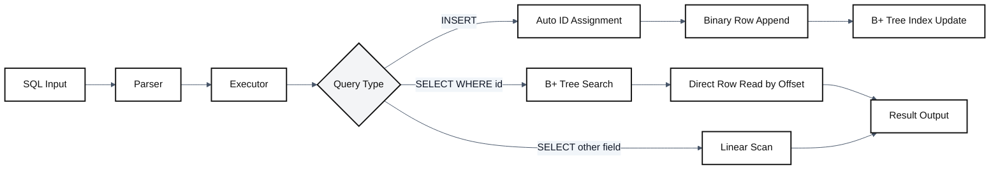

### 3-2. INSERT 파이프라인

- SQL 입력
- Parser에서 INSERT 구문 해석
- Executor에서 다음 ID 생성
- Storage에 바이너리 row append
- append 결과로 `row offset` 획득
- B+ Tree에 `(id, row offset)` 등록

```mermaid
%%{init: {
  "theme": "base",
  "themeVariables": {
    "background": "#ffffff",
    "primaryColor": "#ffffff",
    "primaryTextColor": "#111111",
    "primaryBorderColor": "#111111",
    "lineColor": "#111111",
    "secondaryColor": "#dcfce7",
    "secondaryTextColor": "#111111",
    "tertiaryColor": "#bbf7d0",
    "tertiaryTextColor": "#111111"
  }
}}%%
flowchart LR
    A["User<br/>INSERT INTO ..."] --> B["Parser<br/>Parsed INSERT query"]
    B --> C["Executor<br/>Generate next id"]
    C --> D["Storage<br/>Append row in binary format"]
    D --> E["Executor<br/>Return row offset"]
    E --> F["B+ Tree<br/>Insert (id, row offset)"]
    F --> G["User<br/>Insert success"]

    classDef box fill:#ffffff,stroke:#111111,stroke-width:2px,color:#111111;
    class A,B,C,D,E,F,G box;
```

### 3-3. SELECT 파이프라인

- `WHERE id = ?` 또는 `WHERE id` 범위 조건은 B+ Tree 인덱스 경로 사용
- 인덱스 경로는 B+ Tree에서 row offset 탐색 후 offset 기반 direct read 수행
- `WHERE major = ?` 같은 비인덱스 조건은 B+ Tree를 거치지 않음
- 비인덱스 경로는 전체 row를 선형 탐색하며 조건 비교 수행

```mermaid
%%{init: {
  "theme": "base",
  "themeVariables": {
    "background": "#ffffff",
    "primaryColor": "#ffffff",
    "primaryTextColor": "#111111",
    "primaryBorderColor": "#111111",
    "lineColor": "#111111",
    "secondaryColor": "#f3f4f6",
    "secondaryTextColor": "#111111",
    "tertiaryColor": "#e5e7eb",
    "tertiaryTextColor": "#111111"
  }
}}%%
flowchart TB
    subgraph Indexed["Indexed path: WHERE id = ? / WHERE id range"]
        direction LR
        A["User<br/>SELECT ... WHERE id ..."] --> B["Parser<br/>Parsed SELECT query"]
        B --> C["Executor<br/>Detect id predicate"]
        C --> D["B+ Tree Index<br/>Search id / range"]
        D --> E["Executor<br/>row offset(s)"]
        E --> F["Storage<br/>Read row(s) by offset"]
        F --> G["User<br/>Query result"]
    end

    subgraph NonIndexed["Non-indexed path: WHERE major = ? and other fields"]
        direction LR
        H["User<br/>SELECT ... WHERE major ..."] --> I["Parser<br/>Parsed SELECT query"]
        I --> J["Executor<br/>Detect non-id predicate"]
        J --> K["Storage<br/>Scan all rows"]
        K --> L["User<br/>Query result"]
    end

    classDef box fill:#ffffff,stroke:#111111,stroke-width:2px,color:#111111;
    class A,B,C,D,E,F,G,H,I,J,K,L box;
```

## 3. B+ Tree 인덱스 구조

### 3-1. 왜 B+ Tree를 사용했는가

- 목표는 `WHERE id = ?`를 전체 파일 선형 탐색 없이 처리하는 것입니다.
- 학생 레코드는 바이너리 파일에 저장하고, B+ Tree는 `id -> row offset`만 관리합니다.
- 따라서 `id` 조건은 인덱스를 통해 빠르게 위치를 찾고, `major` 같은 다른 조건은 기존처럼 선형 탐색합니다.

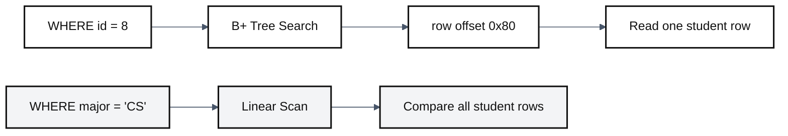

### 3-2. B+ Tree는 어떻게 생겼는가

- Root는 어느 자식 노드로 내려갈지 결정합니다.
- Internal node는 탐색 경로를 분기합니다.
- Leaf node는 실제 `(student id, row offset)`를 저장합니다.
- Leaf node끼리 연결되어 있어 범위 조회를 이어서 처리할 수 있습니다.


### 3-3. B+ Tree는 어떻게 생성되는가

- 테이블이 활성화되면 먼저 인덱스를 초기화합니다.
- 바이너리 파일에 기존 학생 레코드가 있다면 전체를 한 번 스캔해 인덱스를 재구성합니다.
- 이 과정에서 가장 큰 `id`를 찾아 다음 `INSERT`에 사용할 자동 ID도 함께 준비합니다.

```mermaid
%%{init: {
  "theme": "base",
  "themeVariables": {
    "background": "#ffffff",
    "primaryColor": "#f8fafc",
    "primaryTextColor": "#111827",
    "primaryBorderColor": "#334155",
    "lineColor": "#475569",
    "secondaryColor": "#f1f5f9",
    "secondaryTextColor": "#111827",
    "tertiaryColor": "#e2e8f0",
    "tertiaryTextColor": "#111827"
  }
}}%%
flowchart LR
    A["load_table_definition()"] --> B["activate_storage_for_table()"]
    B --> C["index_init()"]
    C --> D["binary_reader_scan_all()"]
    D --> E["build_index_callback()"]
    E --> F["g_next_id_counter = max id"]

    classDef box fill:#ffffff,stroke:#111111,stroke-width:2px,color:#111111;
    class A,B,C,D,E,F box;
```

### 3-4. INSERT 시 노드는 어떻게 추가되는가

- 학생 1명을 `INSERT`하면 먼저 새 `id`를 생성합니다.
- `(id, name, major, grade)`를 바이너리 row로 파일에 append 합니다.
- append 결과로 얻은 `row offset`을 leaf node에 함께 넣습니다.
- 노드가 가득 찬 경우 split을 수행하고, 분할 결과를 부모 노드로 올립니다.

예시 레코드

```sql
INSERT INTO demo.students (name, major, grade)
VALUES ("Kim", "CS", "3");
```

```mermaid
%%{init: {
  "theme": "base",
  "themeVariables": {
    "background": "#ffffff",
    "primaryColor": "#a06d6d",
    "primaryTextColor": "#111111",
    "primaryBorderColor": "#111111",
    "lineColor": "#111111",
    "secondaryColor": "#f3f4f6",
    "secondaryTextColor": "#111111",
    "tertiaryColor": "#e5e7eb",
    "tertiaryTextColor": "#111111"
  }
}}%%
flowchart LR
    A["User<br/>INSERT INTO demo.students ..."] --> B["Executor<br/>next_id() -> 16"]
    B --> C["Storage<br/>binary_writer_append_row()"]
    C --> D["Executor<br/>row offset 0x100"]
    D --> E["B+ Tree<br/>index_insert(16, 0x100)"]
    E --> F["B+ Tree<br/>leaf insert / split if needed"]
    F --> G["User<br/>INSERT 1"]

    classDef box fill:#ffffff,stroke:#111111,stroke-width:2px,color:#111111;
    class A,B,C,D,E,F,G box;
```

### 3-5. 단건 조회는 어떻게 동작하는가

- `WHERE id = ?`는 root부터 시작해 key 범위를 비교하며 leaf까지 내려갑니다.
- leaf에서 `id`를 찾으면 대응하는 `row offset`을 얻습니다.
- 이후 바이너리 파일에서 해당 위치의 학생 row만 직접 읽습니다.

예시 쿼리

```sql
SELECT name, major
FROM demo.students
WHERE id = 8;
```

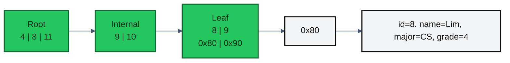

### 3-6. 범위 조회는 어떻게 동작하는가

- `WHERE id >= ?`, `<= ?`는 먼저 시작 leaf를 찾습니다.
- 이후 leaf chain을 따라가며 필요한 범위의 학생 row만 순서대로 읽습니다.
- 따라서 범위 조회는 매번 root부터 다시 시작하지 않고, leaf 간 연결을 활용합니다.

예시 쿼리

```sql
SELECT id, name, major
FROM demo.students
WHERE id >= 8;
```

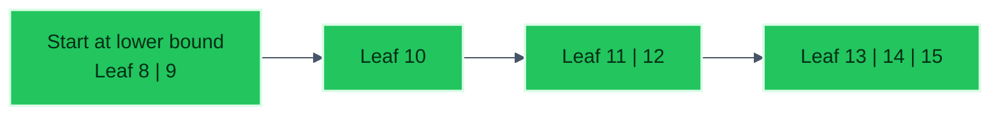

## 4. 시연

### 4-1. 100만 건 데이터 기반 성능 비교

- 데이터 수: `1,000,000`건
- 배치 그룹 수: 각 케이스당 `5회`
- 그룹당 쿼리 반복 횟수: `30회`
- 전체 삽입 시간: `0 ms`
- 데이터셋 소스: `cache_reused (/work/tests/tmp/bench_cache/1000000)`
- 비교 A: `WHERE id = ?` -> B+ Tree 인덱스 사용
- 비교 B: `WHERE student_no = ?` -> 선형 탐색 사용

단건 조회는 앞 / 중간 / 뒤 위치에 있는 학생 레코드를 대상으로 측정했습니다.

| Target ID | Target Name | ID Index ms | StudentNo ms | Speedup |
| ---: | --- | ---: | ---: | ---: |
| 1 | `U1` | `5.900` | `5.580` | `0.95x` |
| 500000 | `U500000` | `5.653` | `225.300` | `39.85x` |
| 1000000 | `U1000000` | `6.513` | `446.573` | `68.57x` |

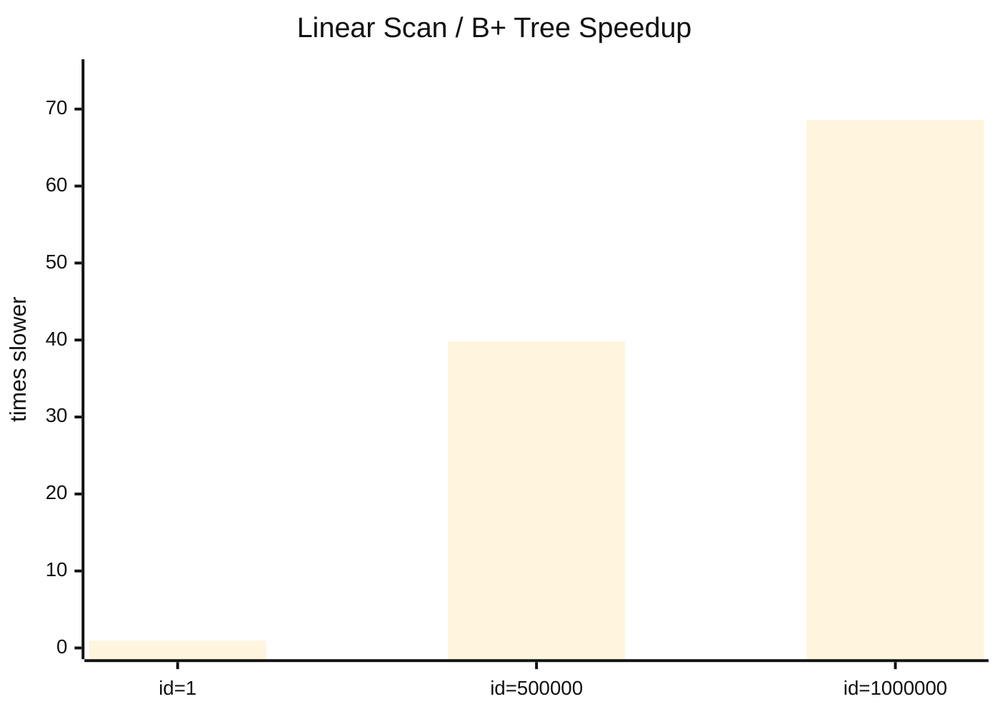

- B+ Tree 기반 `WHERE id = ?`는 전체 구간에서 `약 6ms` 수준으로 거의 일정한 응답 시간을 유지함
- `WHERE student_no = ?` 선형 탐색은 앞쪽 데이터에서는 차이가 거의 없지만, 중간과 마지막 데이터에서는 각각 `39.85x`, `68.57x`까지 느려짐
- 데이터 위치가 뒤로 갈수록 선형 탐색 비용이 급격히 커지고, 인덱스 조회의 장점이 더 분명하게 드러남

### 4-2. CLI 기능 시연

시연 순서
1. `INSERT`로 레코드 추가
2. `SELECT *`로 전체 데이터 확인
3. `WHERE id = ?`로 단건 인덱스 조회
4. `WHERE id >= ?` 또는 `WHERE id <= ?`로 범위 조회
5. `WHERE major = ?`로 비인덱스 조건 조회

예시 SQL

```sql
INSERT INTO demo.students (name, major, grade) VALUES ("Kim", "CS", "3");
INSERT INTO demo.students (name, major, grade) VALUES ("Lee", "Math", "2");

SELECT * FROM demo.students;
SELECT name, major FROM demo.students WHERE id = 1;
SELECT * FROM demo.students WHERE id >= 1;
SELECT * FROM demo.students WHERE major = "CS";
```

### 4-3. CLI 예외 처리

- 존재하지 않는 ID 조회
- 잘못된 조건식 입력
- 지원하지 않는 SQL 형식 입력

## 5. 테스트

### 5-1. 단위 테스트

- B+ Tree 삽입 검증
- key 검색 검증
- 범위 검색 검증
- 노드 분할 이후 검색 정확성 검증
- 존재하지 않는 key 조회 검증

### 5-2. 기능 테스트

- `INSERT` 후 자동 ID 증가 검증
- `SELECT *` 결과 검증
- `WHERE id = ?` 동작 검증
- `WHERE id` 범위 조건 동작 검증
- `WHERE major = ?` 선형 탐색 동작 검증

### 5-3. 통합 관점 검증

- SQL 입력부터 파싱, 실행, 저장, 조회까지 전체 흐름 검증
- 바이너리 저장 구조 전환 이후 결과 일관성 검증
- 인덱스 경로와 비인덱스 경로의 분기 동작 검증

## 6. 소감

- 메모리의 성능을 높이는데, 대규모 데이터에서 일관적이고 압도적인 조회속도로 BPTree를 구성하는 메모리와 비용을 커버한다는 점에서 BPTree의 사용 이유를 충분히 납득하고 그 효용을 잘 알게 되었다.
-BPTree 차수와 BPTree의 깊이가 서로 반비례하는 관계로, 큰 구조로는 트리 구조 탐색이지만 노드 내부는 선형 탐색을 이용하는 구조임을 알게 되면서 적정 차수를 어떻게 잡아야 최적화 할 수 있는지 궁금해졌다.
  
### 6-1. 공통

- 이번 프로젝트를 통해 B+ Tree가 단순한 자료구조 이론이 아니라, 실제 데이터 조회 성능을 개선하기 위한 핵심 인덱스 구조라는 점을 확인할 수 있었습니다.
- 특히 `WHERE id = ?`와 같은 조건에서 선형 탐색과 인덱스 탐색의 차이를 직접 구현하고 비교하면서, 자료구조 선택이 시스템 성능에 어떤 영향을 주는지 체감할 수 있었습니다.
- 또한 성능 최적화는 단순히 “더 빠르게 만든다”는 문제가 아니라, 메모리 사용량과 구현 복잡도 같은 비용을 함께 고려해야 하는 설계 문제라는 점도 배울 수 있었습니다.

### 6-2. 개인 소감

- 찬빈: 이번 프로젝트를 진행하면서 B+ Tree는 데이터를 빠르게 찾는 데 매우 유용한 구조라는 점을 직접 체감할 수 있었다. 다만 조회 속도를 높이기 위해 별도의 인덱스를 유지해야 하므로, 그만큼 추가적인 메모리 사용이 필요하다는 점도 함께 이해하게 되었다. 이를 통해 성능 향상에는 반드시 비용이 뒤따르며, 시스템 설계에서는 속도와 자원 사용 사이의 균형을 함께 고려해야 한다는 점이 인상 깊었다.
- 민정: B+ Tree를 공부하면서 자료구조가 단순히 이론으로만 존재하는 것이 아니라, 실제 데이터 조회 성능을 개선하기 위해 구체적으로 활용된다는 점을 이해할 수 있었다. 특히 모든 데이터를 순차적으로 탐색하지 않고, 정렬된 구조를 바탕으로 탐색 범위를 빠르게 좁혀 간다는 점이 인상적이었다. 이를 통해 인덱스는 단순한 저장 구조가 아니라, 대량의 데이터에서 원하는 값을 효율적으로 찾기 위한 탐색 전략이라는 점을 배울 수 있었다.
- 혜연: 처음으로 프로젝트 구현을 맡게 되면서 어떻게 해야 효율적으로 코덱스 plan을 짜고, 팀원들 간 학습한 내용을 잘 공유할 수 있을 지 고민해서 그 내용을 적용할 수 있어서 의미가 깊었다. 뿐만 아니라 선형탐색으로 특정 row를 조회하는 시간과 B+Tree를 적용시켜 조회하는 시간을 직접 data-driven으로 그 압도적인 차이를 확인하면서 왜 메모리와 비용을 더 많이 쓰면서라도 이 시스템을 사용하는 지 확실하게 납득하게 되었다. 
- 정연: B+Tree가 탐색 속도를 높인다는 막연하게 알았으나, 이번 코딩회를 통해 함수 하나하나를 분석하고 해석하는 학습을 통해 이해를 높일 수 있었다. 특히 재귀를 통해서 leaf node 까지 내려간 다음 다시 올라가면서 트리를 재배치 하는 구성을 이해하는 과정에서 머릿속에 흩어졌던 지식이 연결되는 성취감을 느꼈다.
