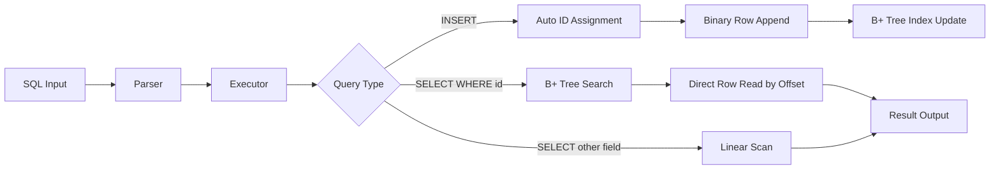
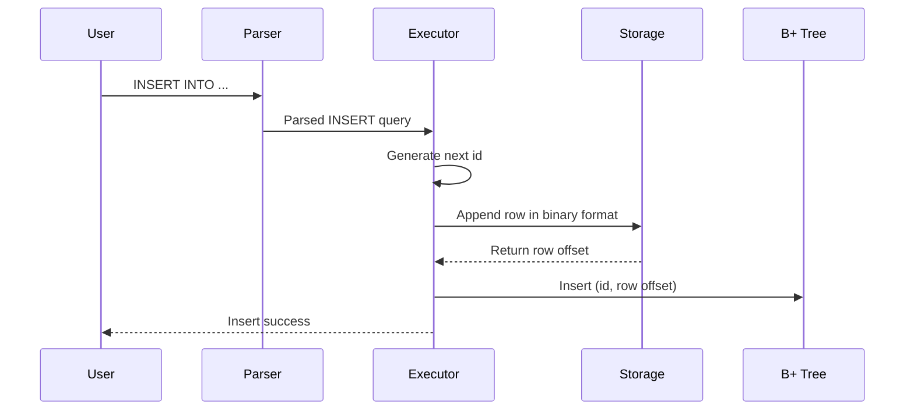
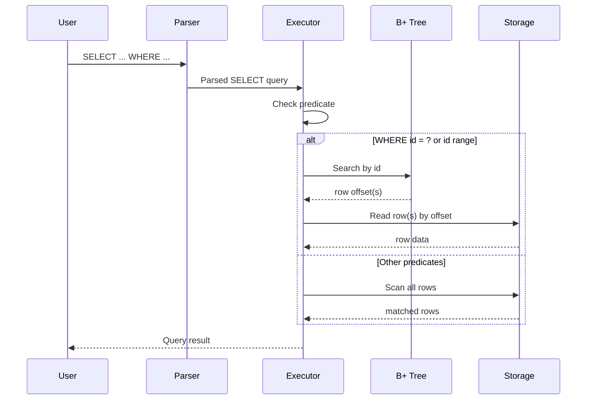
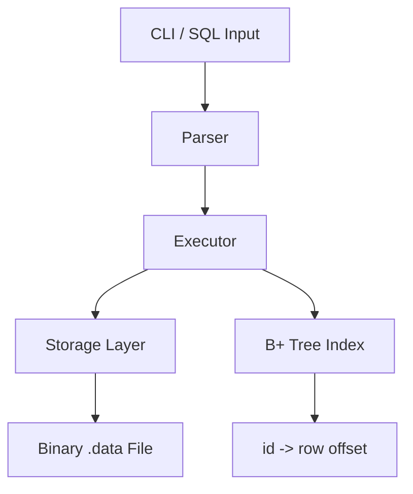
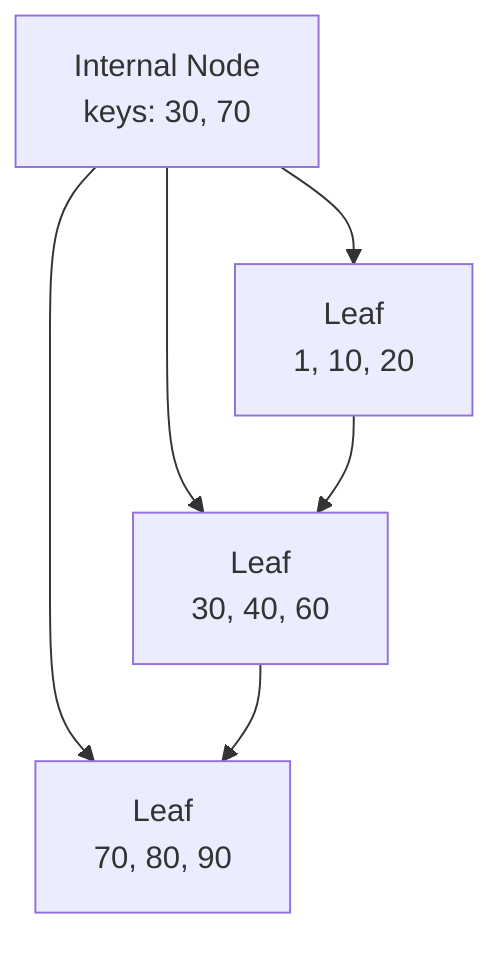

# B+ Tree Index Mini SQL

- 기존 Mini SQL 처리기에 `자동 ID`, `바이너리 저장`, `메모리 기반 B+ Tree 인덱스`를 결합한 프로젝트
- `WHERE id = ?` 및 `WHERE id` 범위 조건을 인덱스 경로로 처리
- 비인덱스 조건은 선형 탐색으로 처리
- 1,000,000건 이상 데이터 기준 성능 비교 수행

## 1. 서비스

### 1-1. 한 줄 설명

- `INSERT` 시 자동으로 ID를 부여하고, 해당 ID를 B+ Tree 인덱스에 등록해 `WHERE id = ?` 조회를 빠르게 처리하는 Mini SQL 엔진

### 1-2. 프로젝트 목표

- 기존 SQL 처리기의 선형 탐색 기반 조회 구조 확장
- `WHERE id = ?` 조건에서 인덱스 사용 가능하도록 개선
- 대용량 데이터에서 인덱스 조회와 선형 탐색의 차이 검증
- 기존 SQL 처리기와 인덱스 구조의 자연스러운 연결

### 1-3. 지원 기능

- `INSERT`
- `SELECT *`
- `SELECT ... WHERE id = ?`
- `SELECT ... WHERE id > ?`, `>= ?`, `< ?`, `<= ?`
- `SELECT ... WHERE major = ?` 등 비인덱스 조건 조회
- CLI 기반 SQL 입력 및 실행
- 대량 데이터 삽입 및 성능 측정

### 1-4. 데이터 저장 구조

- `.data` 텍스트 포맷 대신 바이너리 row 포맷 사용
- 각 row를 파일 내 `row offset`으로 직접 접근
- B+ Tree에 `id -> row offset` 매핑 유지
- 인덱스 조회 시 파일 전체를 순회하지 않고 row 위치로 직접 이동

```text
[Data File]
row0 ----> byte offset 0
row1 ----> byte offset 48
row2 ----> byte offset 96

[B+ Tree]
1 -> 0
2 -> 48
3 -> 96
```

## 2. 파이프라인

### 2-1. 전체 처리 흐름



### 2-2. INSERT 파이프라인

- SQL 입력
- Parser에서 INSERT 구문 해석
- Executor에서 다음 ID 생성
- Storage에 바이너리 row append
- append 결과로 `row offset` 획득
- B+ Tree에 `(id, row offset)` 등록



### 2-3. SELECT 파이프라인

- `WHERE id = ?` 또는 `WHERE id` 범위 조건이면 인덱스 경로 선택
- B+ Tree에서 row offset 탐색
- offset 기반 direct read 수행
- 비인덱스 조건이면 전체 row 선형 탐색 수행



## 3. 핵심 구현 내용

- 발표 시간이 짧을 경우 이론 설명 중심으로 진행
- 시간이 남을 경우 코드 레벨 포인트까지 확장 설명

### 3-1. INSERT 시 자동 ID 생성 및 인덱스 등록

#### 이론

- `INSERT` 실행 시 다음 ID 자동 생성
- 생성된 ID를 포함한 row를 바이너리 포맷으로 저장
- 저장 직후 row 시작 위치인 `row offset` 확보
- `(id, row offset)`를 B+ Tree에 즉시 등록

#### 코드 레벨 포인트

- 자동 ID 생성 위치
- 바이너리 row append 위치
- append 이후 row offset 반환 지점
- `bptree_insert(id, row_offset)` 호출 시점

### 3-2. 인덱스 경로와 선형 탐색 경로 분리

#### 이론

- `WHERE id = ?`는 B+ Tree 인덱스 사용
- `WHERE id >= ?`, `<= ?` 등 범위 조건은 leaf 순회 사용
- `WHERE major = ?` 같은 조건은 선형 탐색 사용
- 조건 종류에 따라 실행 경로를 분기

#### 코드 레벨 포인트

- 조건 컬럼이 `id`인지 판단하는 분기
- 단건 조회와 범위 조회의 인덱스 진입 방식
- 비인덱스 조건을 linear scan으로 처리하는 흐름

### 3-3. B+ Tree 노드 구성 방식

#### 이론

- 내부 노드는 key와 child pointer 보유
- 리프 노드는 key와 value(`row offset`) 보유
- 리프 노드 간 연결을 통해 범위 조회 지원
- 노드가 가득 차면 split 수행
- split 결과를 부모 노드에 반영

#### 컴포넌트 다이어그램



#### B+ Tree 구조 예시



#### 코드 레벨 포인트

- 노드 구조체 정의
- leaf/internal 분기 방식
- insert 시 split 발생 조건
- range query에서 leaf link 순회 방식

## 4. 시연

### 4-1. CLI 기능 시연

시연 순서
1. `INSERT`로 레코드 추가
2. `SELECT *`로 전체 데이터 확인
3. `WHERE id = ?`로 단건 인덱스 조회
4. `WHERE id >= ?` 또는 `WHERE id <= ?`로 범위 조회
5. `WHERE major = ?`로 비인덱스 조건 조회

예시 SQL

```sql
INSERT INTO demo.students (name, major, grade) VALUES ("Kim", "CS", "3");
INSERT INTO demo.students (name, major, grade) VALUES ("Lee", "Math", "2");

SELECT * FROM demo.students;
SELECT name, major FROM demo.students WHERE id = 1;
SELECT * FROM demo.students WHERE id >= 1;
SELECT * FROM demo.students WHERE major = "CS";
```

### 4-2. CLI 예외 처리

- 존재하지 않는 ID 조회
- 잘못된 조건식 입력
- 지원하지 않는 SQL 형식 입력

### 4-3. 100만 건 데이터 기반 성능 비교

- 데이터 수: `1,000,000`건 이상
- 비교 A: `WHERE id = ?` -> B+ Tree 인덱스 사용
- 비교 B: `WHERE major = ?` -> 선형 탐색 사용
- 인덱스 경로와 선형 탐색 경로의 실행 시간 비교

#### 측정 예시 결과

| 항목 | 실행 시간 | 접근 경로 |
| --- | ---: | --- |
| `WHERE id = ?` | 540 ms | B+ Tree Index |
| `WHERE major = ?` | 958 ms | Linear Scan |

#### 해석 포인트

- `WHERE id = ?`는 row 위치를 직접 찾기 때문에 조회 비용이 작음
- `WHERE major = ?`는 전체 row 비교가 필요해 비용이 큼
- 동일한 SELECT라도 조건에 따라 실행 경로가 달라짐

## 5. 테스트

### 5-1. 단위 테스트

- B+ Tree 삽입 검증
- key 검색 검증
- 범위 검색 검증
- 노드 분할 이후 검색 정확성 검증
- 존재하지 않는 key 조회 검증

### 5-2. 기능 테스트

- `INSERT` 후 자동 ID 증가 검증
- `SELECT *` 결과 검증
- `WHERE id = ?` 동작 검증
- `WHERE id` 범위 조건 동작 검증
- `WHERE major = ?` 선형 탐색 동작 검증

### 5-3. 통합 관점 검증

- SQL 입력부터 파싱, 실행, 저장, 조회까지 전체 흐름 검증
- 바이너리 저장 구조 전환 이후 결과 일관성 검증
- 인덱스 경로와 비인덱스 경로의 분기 동작 검증

## 6. 소감

- 추후 작성 예정
