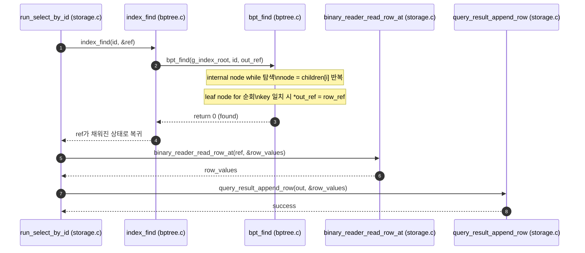
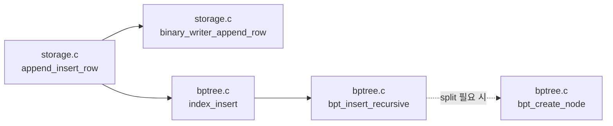
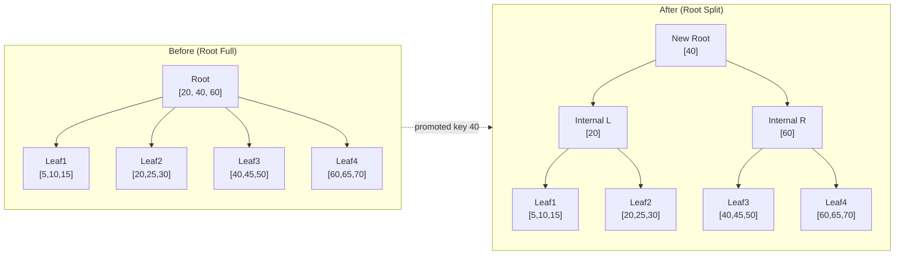

# 순차 호출 흐름(SELECT)
1. `index_find` (`bptree.c`)
- B+ tree 접근 진입점이다.
- 내부에서 `bpt_find(g_index_root, id, out_ref)`를 호출한다.

2. `bpt_find` (`bptree.c`)
- 루트부터 리프까지 내려가며 `id`를 탐색한다.
- 첫 번째 `while`에서 `node`를 계속 자식으로 갱신하며 내부 노드를 내려간다.
- 리프에 도착하면 `for`로 리프 키를 순회해 일치 키를 찾는다.
- 일치 시 `*out_ref = row_ref`를 기록하고 성공 코드를 반환한다.

3. `run_select_by_id` (`storage.c`)
- 반환된 `out_ref`(row_ref)를 사용해 실제 row를 읽는다.
- 즉시 `binary_reader_read_row_at(ref, &row_values)`를 호출한다.

## 시퀀스 다이어그램

# 순차 호출 흐름(INSERT)
1. `binary_writer_append_row (storage.c)`
- binary 파일에 쓰여진 해당 row의 row_ref를 반환한다.

2. `index_insert (bptree.c)`
- id를 생성하고 row_ref를 받아와서 B+tree에 넣으러 들어간다(중복 id 필터링).

3. `bpt_insert_recursive (bptree.c)`
- B+tree에 삽입을 하는 로직. node 아래로 내려가기, 알맞은 leaf에 넣기 실행
- 만약 node의 분할이 필요하다면? => `bpt_create_node`를 호출하여 분할 시행

## 컴포넌트 다이어그램

## Root Split 전/후 비교

