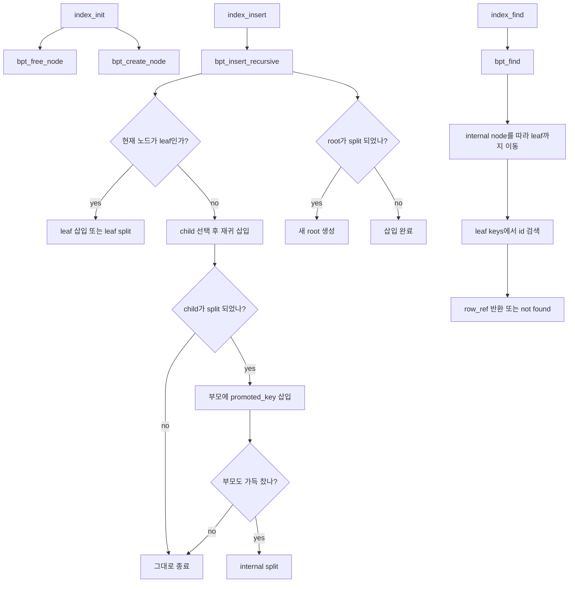
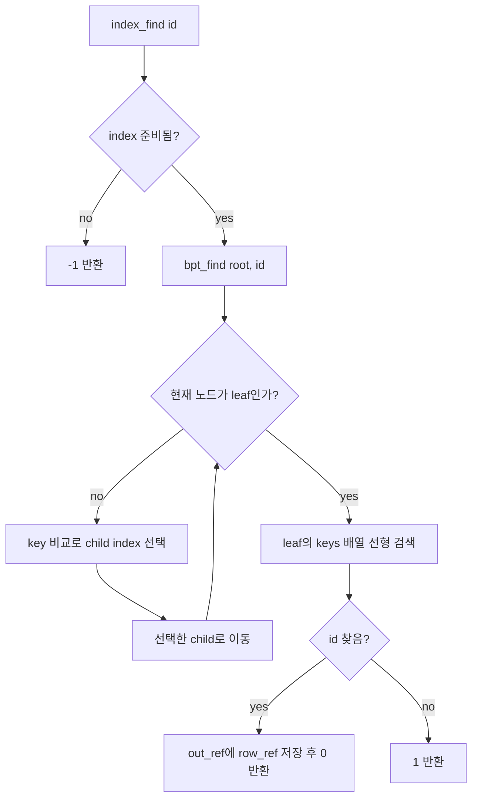
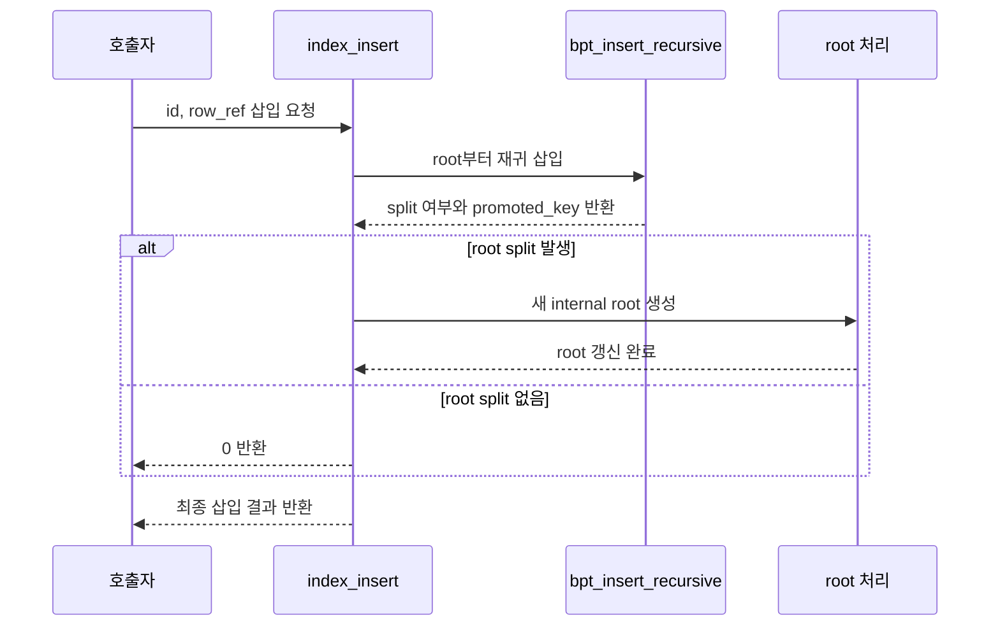
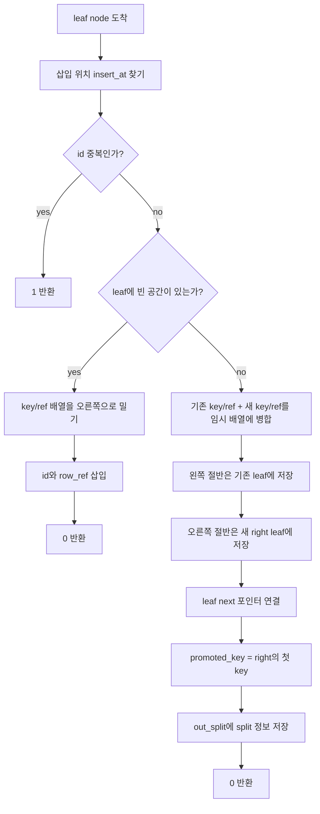
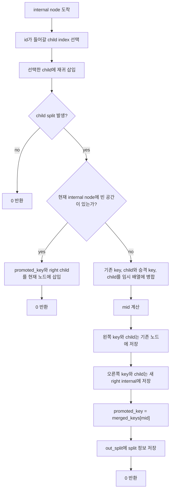
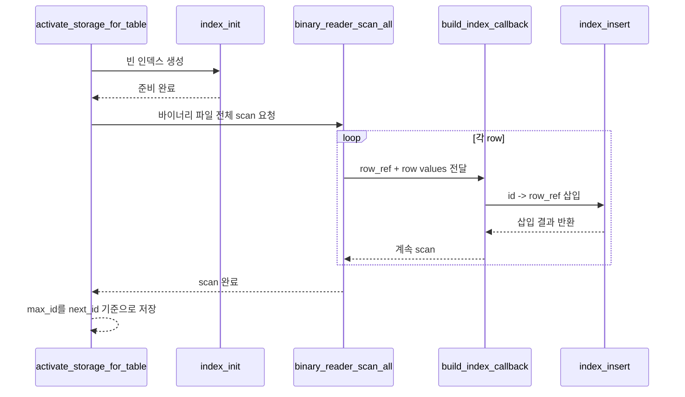
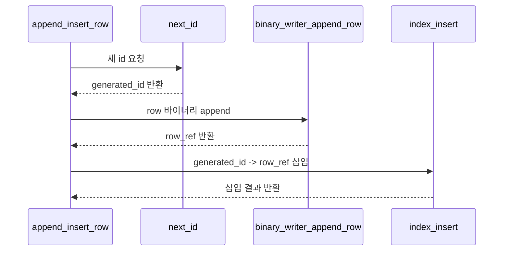
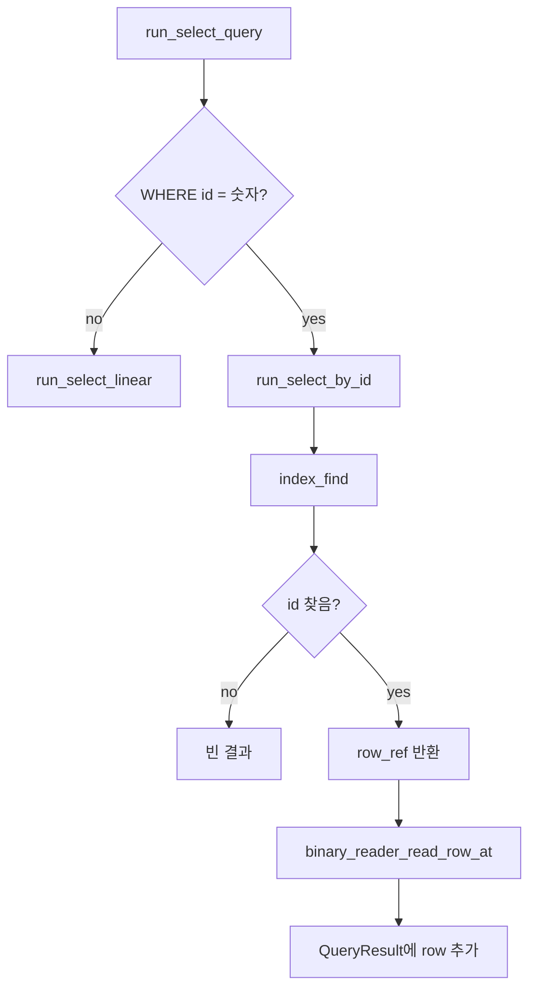
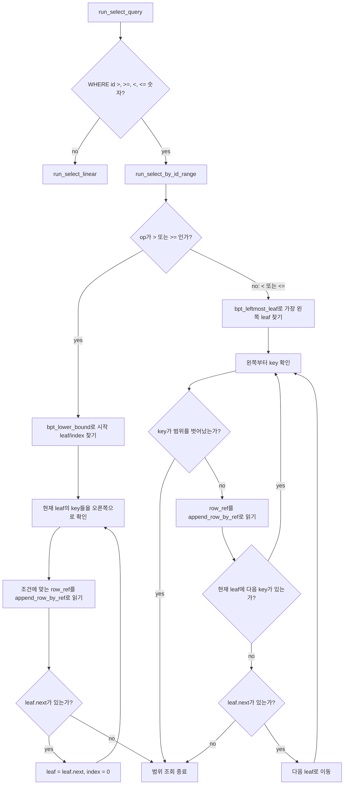

# B+ Tree 구현 방식과 함수 흐름

이 문서는 우리 프로젝트에서 B+ Tree가 코드로 어떻게 구현되어 있는지 설명합니다.

01 문서는 개념, 02 문서는 프로젝트 적용 목적을 다뤘습니다.
이 문서는 실제 구현 구조와 함수 호출 흐름을 중심으로 봅니다.

## 1. 먼저 알아둘 점

현재 프로젝트에는 B+ Tree 구현을 볼 수 있는 파일이 두 곳 있습니다.

- [`src/bptree.c`](../../../../src/bptree.c)
- [`src/storage.c`](../../../../src/storage.c)

현재 기본 빌드(`Makefile`)는 `src/storage.c` 안의 B+ Tree 구현을 사용합니다.
`src/bptree.c`는 알고리즘을 따로 공부하기 좋은 파일로 보면 됩니다.

공부할 때는 이렇게 보면 좋습니다.

| 목적 | 볼 파일 |
| --- | --- |
| B+ Tree 알고리즘만 보기 | [`src/bptree.c`](../../../../src/bptree.c) |
| SQL 저장소와 연결된 실제 흐름 보기 | [`src/storage.c`](../../../../src/storage.c) |

이 문서의 함수 설명은 알고리즘은 `src/bptree.c`, 프로젝트 연결 흐름은 `src/storage.c` 기준으로 설명합니다.

## 2. 핵심 자료구조

### 2-1. `BptNode`

관련 코드:

- [`BptNode`](../../../../src/storage.c#L11)

```c
struct BptNode {
    bool is_leaf;
    size_t size;
    uint64_t keys[BPTREE_MAX_KEYS];
    union {
        struct {
            RowRef refs[BPTREE_MAX_KEYS];
            BptNode *next;
        } leaf;
        struct {
            BptNode *children[BPTREE_MAX_KEYS + 1];
        } internal;
    } as;
};
```

이 구조체는 leaf 노드와 internal 노드를 하나의 타입으로 표현합니다.

공통 필드:

- `is_leaf`: leaf 노드인지 구분한다.
- `size`: 현재 key 개수이다.
- `keys`: 정렬된 id key 배열이다.

leaf 노드 전용 필드:

- `refs`: 각 id에 대응되는 `row_ref` 배열이다.
- `next`: 오른쪽 leaf 노드를 가리킨다. 범위 조회에서 이 포인터를 따라 다음 leaf로 이동한다.

internal 노드 전용 필드:

- `children`: 다음 단계 자식 노드 포인터 배열이다.

## 3. 전체 함수 지도



이 그래프에서 핵심은 split 결과가 아래에서 위로 올라간다는 점입니다.
leaf가 split되면 오른쪽 leaf의 첫 key가 부모로 올라가고, internal 노드가 split되면 중앙 key가 부모로 올라갑니다.

## 4. 인덱스 초기화 흐름

관련 함수:

- [`index_init`](../../../../src/bptree.c#L249)
- [`bpt_free_node`](../../../../src/bptree.c#L45)
- [`bpt_create_node`](../../../../src/bptree.c#L34)

```mermaid
sequenceDiagram
    participant Caller as 호출자
    participant Init as index_init
    participant Free as bpt_free_node
    participant Create as bpt_create_node

    Caller->>Init: 인덱스 초기화 요청
    Init->>Free: 기존 root 제거
    Free-->>Init: 제거 완료
    Init->>Create: 새 leaf root 생성
    Create-->>Init: BptNode* 반환
    Init-->>Caller: 성공 0 또는 실패 -1 반환
```

`index_init`은 기존 트리를 버리고, 빈 leaf 노드 하나를 새 root로 만듭니다.

처음에는 root가 곧 leaf입니다.

```text
[ empty leaf root ]
```

## 5. 검색 흐름

관련 함수:

- [`index_find`](../../../../src/bptree.c#L288)
- [`bpt_find`](../../../../src/bptree.c#L61)



검색은 root에서 시작합니다.
internal 노드에서는 key를 비교해서 어느 child로 내려갈지 결정합니다.
leaf에 도착하면 leaf 안의 key 배열에서 id를 찾습니다.

찾으면 `row_ref`를 반환하고, 못 찾으면 `1`을 반환합니다.

반환값 의미:

```text
0  = 찾음
1  = 없음
-1 = 인덱스 준비 안 됨 또는 오류
```

## 6. 삽입 흐름

관련 함수:

- [`index_insert`](../../../../src/bptree.c#L260)
- [`bpt_insert_recursive`](../../../../src/bptree.c#L86)



`index_insert`는 실제 삽입을 `bpt_insert_recursive`에 맡깁니다.
삽입 결과 root가 split되었다면 새 root를 만듭니다.

## 7. leaf 노드 삽입 흐름

`bpt_insert_recursive`가 leaf 노드를 만났을 때의 흐름입니다.



leaf 노드가 가득 차지 않았다면 단순히 정렬 위치에 삽입합니다.

leaf 노드가 가득 찼다면 split합니다.
이때 오른쪽 leaf의 첫 key가 부모로 올라갈 key가 됩니다.

```text
promoted_key = right->keys[0]
```

## 8. internal 노드 삽입 흐름

`bpt_insert_recursive`가 internal 노드를 만났을 때의 흐름입니다.



internal 노드의 역할은 leaf까지 내려가는 길을 안내하는 것입니다.
child가 split되면 그 split 결과를 현재 internal 노드에 반영해야 합니다.

현재 internal 노드도 가득 찼다면 다시 split하고, 중앙 key를 부모로 올립니다.

## 9. 프로젝트 연결 흐름

B+ Tree 함수는 단독으로 존재하지 않고, 저장소 흐름에 연결됩니다.

### 9-1. 기존 데이터로 인덱스 재구성

관련 함수:

- [`activate_storage_for_table`](../../../../src/storage.c#L1024)
- [`binary_reader_scan_all`](../../../../src/storage.c#L813)
- [`build_index_callback`](../../../../src/storage.c#L995)
- [`index_insert`](../../../../src/storage.c#L320)



프로젝트의 인덱스는 메모리 기반이기 때문에 테이블을 활성화할 때 기존 데이터로 인덱스를 다시 만듭니다.

### 9-2. INSERT 후 인덱스 등록

관련 함수:

- [`append_insert_row`](../../../../src/storage.c#L1415)
- [`binary_writer_append_row`](../../../../src/storage.c#L726)
- [`index_insert`](../../../../src/storage.c#L320)



새 row가 저장되면, 저장 위치인 `row_ref`가 바로 B+ Tree에 등록됩니다.

### 9-3. SELECT WHERE id 조회

관련 함수:

- [`run_select_query`](../../../../src/storage.c#L1546)
- [`is_id_equality_predicate`](../../../../src/storage.c#L1192)
- [`run_select_by_id`](../../../../src/storage.c#L1246)
- [`index_find`](../../../../src/storage.c#L348)
- [`binary_reader_read_row_at`](../../../../src/storage.c#L784)



id 조건이면 B+ Tree에서 `row_ref`를 찾고, 그 위치의 row 하나만 읽습니다.

### 9-4. SELECT WHERE id 범위 조회

관련 함수:

- [`is_id_range_predicate`](../../../../src/storage.c#L1208)
- [`run_select_by_id_range`](../../../../src/storage.c#L1260)
- [`bpt_lower_bound`](../../../../src/storage.c#L108)
- [`bpt_leftmost_leaf`](../../../../src/storage.c#L88)
- [`append_row_by_ref`](../../../../src/storage.c#L1225)



예를 들어 leaf들이 아래처럼 연결되어 있다고 가정합니다.

```text
[1 | 5 | 9] -> [12 | 20 | 35] -> [42 | 50 | 60] -> [70 | 80]
```

`WHERE id >= 10`은 `bpt_lower_bound`로 `12`가 있는 leaf 위치를 찾은 뒤 오른쪽으로 계속 이동합니다.

```text
시작: [12 | 20 | 35]의 12
읽기: 12, 20, 35
next: [42 | 50 | 60]
읽기: 42, 50, 60
next: [70 | 80]
읽기: 70, 80
```

`WHERE id <= 50`은 가장 왼쪽 leaf부터 읽다가 `50`보다 큰 key를 만나면 멈춥니다.

```text
시작: [1 | 5 | 9]
읽기: 1, 5, 9
next: [12 | 20 | 35]
읽기: 12, 20, 35
next: [42 | 50 | 60]
읽기: 42, 50
60에서 조건을 벗어나므로 중단
```

이것이 B+ Tree에서 leaf 연결 리스트가 중요한 이유입니다.
단건 조회는 leaf에서 key 하나를 찾고 끝나지만, 범위 조회는 시작 leaf를 찾은 뒤 leaf들의 `next`를 따라가며 여러 row를 읽습니다.

## 10. 이 구현에서 중요한 반환 구조

삽입 중 split 여부는 `BptSplitResult`로 부모에게 전달됩니다.

관련 코드:

- [`BptSplitResult`](../../../../src/storage.c#L27)

```c
typedef struct {
    bool split;
    uint64_t promoted_key;
    BptNode *right;
} BptSplitResult;
```

필드 의미:

- `split`: 현재 노드가 split되었는지 여부
- `promoted_key`: 부모로 올릴 key
- `right`: split 후 새로 생긴 오른쪽 노드

이 구조체 덕분에 child 노드의 split 결과가 부모 노드로 전달됩니다.

```text
child split
-> promoted_key와 right node 생성
-> parent가 그 정보를 받아 자신의 key/child 배열에 삽입
```

## 11. 이 문서에서 기억할 것

우리 프로젝트의 B+ Tree 구현은 다음 흐름으로 이해하면 됩니다.

1. `index_init`으로 빈 트리를 만든다.
2. `index_insert`가 `bpt_insert_recursive`로 leaf까지 내려가 id와 row_ref를 넣는다.
3. 노드가 가득 차면 split하고, `BptSplitResult`로 부모에게 승격 정보를 전달한다.
4. `index_find`는 internal node를 따라 leaf까지 내려가 id를 찾고 row_ref를 반환한다.
5. `run_select_by_id_range`는 leaf의 `next` 연결을 따라 id 범위에 해당하는 row_ref들을 순서대로 읽는다.
6. 저장소 계층은 이 row_ref로 바이너리 파일의 특정 위치를 바로 읽는다.

한 문장으로 요약하면:

```text
B+ Tree 구현은 id를 정렬된 key로 관리하고, leaf node에 저장된 row_ref와 leaf.next 연결을 통해 단건 row 위치 또는 범위 row 위치들을 빠르게 찾도록 만든 구조이다.
```
