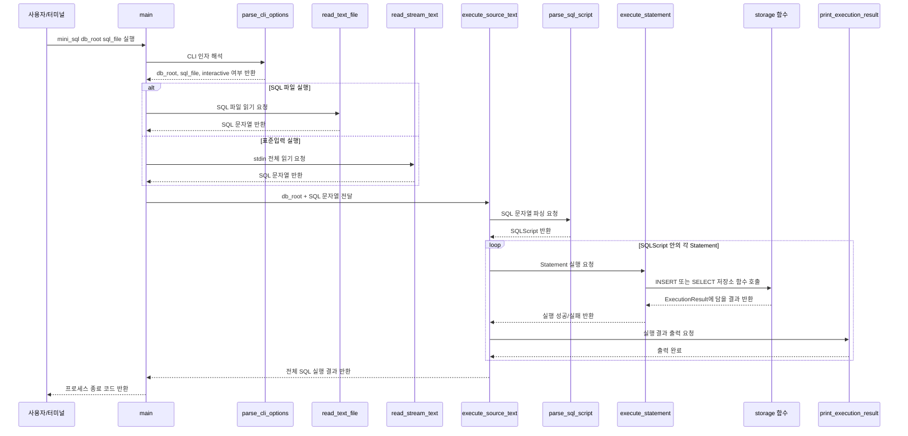
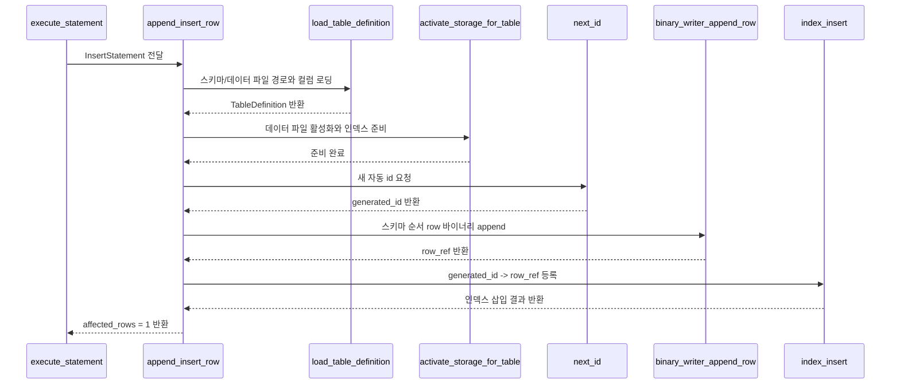
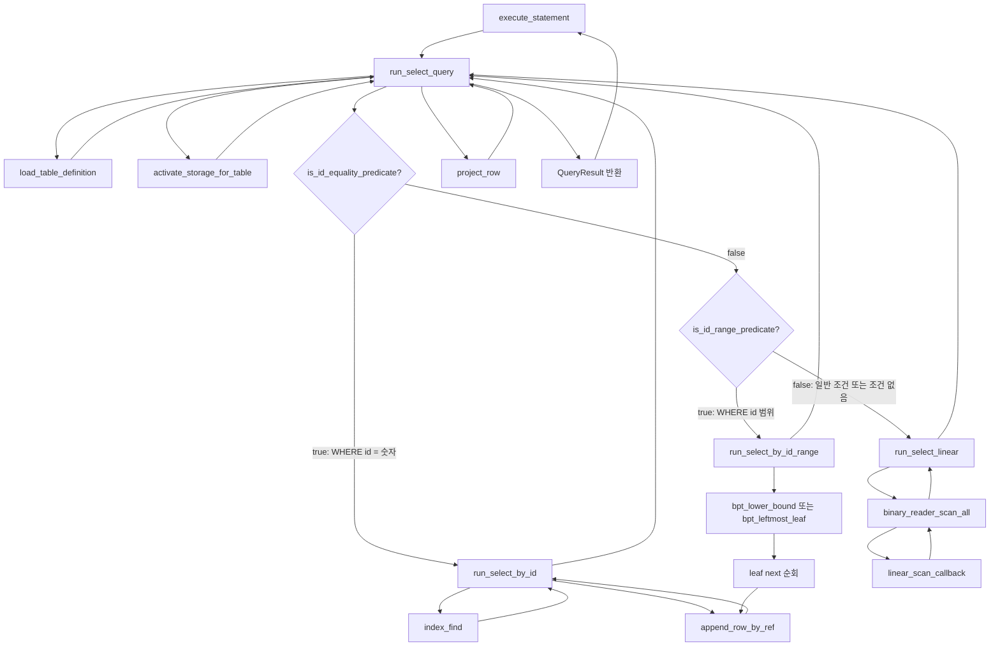

# 함수 호출 흐름으로 보는 프로젝트 동작

이 문서는 `01-execution-file-flow.md` 다음에 읽는 문서입니다.

01 문서가 "어떤 파일을 어떤 순서로 읽을지"를 다뤘다면, 이 문서는 전체 프로그램이 실행될 때 함수들이 어떤 순서로 이어지는지에 집중합니다.
따라서 파일별 설명은 최소화하고, 함수 호출 관계와 각 함수의 책임을 중심으로 정리합니다.

## 이 문서를 읽는 방법

이 문서는 함수 흐름을 넓게 다루기 때문에 처음부터 끝까지 한 번에 읽으면 길게 느껴질 수 있습니다.
목적에 따라 아래 순서로 골라 읽으면 됩니다.

| 목적 | 먼저 읽을 섹션 |
| --- | --- |
| 전체 실행 흐름만 빠르게 보기 | `0`, `1`, `5`, `17`, `18` |
| INSERT 흐름 이해하기 | `0-2`, `6`, `12`, `14` |
| SELECT id 단건 조회 이해하기 | `0-3`, `7`, `8`, `12`, `14` |
| SELECT id 범위 조회 이해하기 | `0-3`, `7`, `9`, `14` |
| id가 아닌 조건의 선형 스캔 이해하기 | `0-3`, `7`, `10` |
| 파서가 SQL을 구조체로 바꾸는 과정 보기 | `4` |
| 바이너리 파일 저장/읽기 이해하기 | `12`, `13` |
| 문제가 생겼을 때 따라가기 | `18` |

처음 공부할 때 추천 순서는 다음과 같습니다.

```text
1. 0번 그래프로 전체 호출과 반환 흐름 보기
2. 6번 INSERT 흐름 보기
3. 7~9번 SELECT 분기 흐름 보기
4. 12번 바이너리 읽기/쓰기 흐름 보기
5. 14번 B+ Tree 함수 흐름 보기
6. 18번 디버깅 순서로 복습하기
```

## 0. 호출과 반환 흐름 그래프

아래 그래프는 함수를 "호출한다"에서 끝내지 않고, 호출 결과가 다시 어디로 돌아오는지까지 보여주는 지도입니다.
화살표 `->>`는 함수 호출, 점선 화살표 `-->>`는 결과 반환을 뜻합니다.

### 0-1. SQL 파일 실행 전체 흐름



이 그래프에서 가장 중요한 점은 `execute_source_text`가 파싱, 실행, 출력을 모두 순서대로 연결하는 중심 함수라는 것입니다.
`main`은 준비와 종료를 맡고, 실제 SQL 처리 반복은 `execute_source_text` 안에서 일어납니다.

### 0-2. INSERT 호출과 반환 흐름



INSERT 흐름에서는 `row_ref`가 핵심 반환값입니다.
`binary_writer_append_row`가 파일에 row를 저장하면서 offset을 반환하고, `append_insert_row`는 그 offset을 곧바로 `index_insert`에 넘겨 B+ 트리에 등록합니다.

### 0-3. SELECT 호출과 반환 흐름



SELECT 흐름은 먼저 `is_id_equality_predicate`에서 단건 id 조건인지 확인하고, 아니면 `is_id_range_predicate`에서 id 범위 조건인지 확인합니다.
id 단건 조건이면 B+ 트리에서 `row_ref` 하나를 받아 해당 위치만 읽고, id 범위 조건이면 B+ 트리 leaf를 순회합니다.
둘 다 아니면 전체 바이너리 파일을 scan하면서 조건을 검사합니다.
두 경로 모두 `run_select_query`로 돌아온 뒤 `project_row`를 거쳐 최종 `QueryResult`가 만들어집니다.

## 0-4. 핵심 함수 바로가기

아래 표에서 함수 이름을 누르면 해당 함수 정의 위치로 바로 이동할 수 있습니다.
GitHub, VS Code Markdown preview, 일부 Markdown 뷰어에서는 `#L번호` 링크가 해당 줄 근처로 이동합니다.

| 흐름 | 바로가기 |
| --- | --- |
| 시작점 | [`main`](../../../../src/main.c#L437), [`parse_cli_options`](../../../../src/main.c#L279), [`execute_source_text`](../../../../src/main.c#L118), [`run_interactive`](../../../../src/main.c#L372) |
| 입력 | [`read_text_file`](../../../../src/common.c#L95), [`read_stream_text`](../../../../src/main.c#L242), [`buffer_append_n`](../../../../src/main.c#L213), [`buffer_append`](../../../../src/main.c#L238) |
| 파싱 | [`parse_sql_script`](../../../../src/parser.c#L763), [`tokenize_sql`](../../../../src/parser.c#L219), [`parse_insert`](../../../../src/parser.c#L622), [`parse_select`](../../../../src/parser.c#L682) |
| 실행 분기 | [`execute_statement`](../../../../src/executor.c#L7), [`print_execution_result`](../../../../src/executor.c#L54) |
| INSERT | [`append_insert_row`](../../../../src/storage.c#L1415), [`next_id`](../../../../src/storage.c#L361), [`binary_writer_append_row`](../../../../src/storage.c#L726), [`index_insert`](../../../../src/storage.c#L320) |
| SELECT 공통 | [`run_select_query`](../../../../src/storage.c#L1546), [`is_id_equality_predicate`](../../../../src/storage.c#L1192), [`is_id_range_predicate`](../../../../src/storage.c#L1208), [`project_row`](../../../../src/storage.c#L1155) |
| SELECT id 단건 경로 | [`run_select_by_id`](../../../../src/storage.c#L1246), [`index_find`](../../../../src/storage.c#L348), [`append_row_by_ref`](../../../../src/storage.c#L1225), [`binary_reader_read_row_at`](../../../../src/storage.c#L784) |
| SELECT id 범위 경로 | [`run_select_by_id_range`](../../../../src/storage.c#L1260), [`bpt_lower_bound`](../../../../src/storage.c#L108), [`append_row_by_ref`](../../../../src/storage.c#L1225) |
| SELECT 선형 경로 | [`run_select_linear`](../../../../src/storage.c#L1346), [`binary_reader_scan_all`](../../../../src/storage.c#L813), [`linear_scan_callback`](../../../../src/storage.c#L1321) |
| 저장소 준비 | [`load_table_definition`](../../../../src/storage.c#L1369), [`activate_storage_for_table`](../../../../src/storage.c#L1024), [`build_index_callback`](../../../../src/storage.c#L995) |
| 마이그레이션 | [`file_looks_binary`](../../../../src/storage.c#L942), [`migrate_text_data_to_binary`](../../../../src/storage.c#L854), [`read_text_line`](../../../../src/storage.c#L580), [`split_pipe_line`](../../../../src/storage.c#L485) |
| B+ 트리 | [`index_init`](../../../../src/storage.c#L309), [`bpt_insert_recursive`](../../../../src/storage.c#L146), [`bpt_find`](../../../../src/storage.c#L68) |
| 메모리 해제 | [`free_script`](../../../../src/parser.c#L470), [`free_statement`](../../../../src/parser.c#L453), [`free_query_result`](../../../../src/storage.c#L1683), [`free_execution_result`](../../../../src/executor.c#L31) |

## 1. 전체 실행 흐름

프로그램 전체는 아래 큰 흐름으로 움직입니다.

```text
main
-> parse_cli_options
-> SQL 입력 확보
-> parse_sql_script
-> execute_statement
-> INSERT 또는 SELECT 저장소 함수
-> print_execution_result
```

즉, 이 프로젝트는 크게 네 단계로 나눌 수 있습니다.

1. 입력 단계: SQL 파일 또는 사용자 입력을 문자열로 만든다.
2. 파싱 단계: SQL 문자열을 `Statement` 구조체로 바꾼다.
3. 실행 단계: `Statement` 타입에 따라 INSERT 또는 SELECT를 수행한다.
4. 출력 단계: 실행 결과를 터미널에 출력한다.

## 2. CLI 입력 함수 흐름

파일, 표준입력, 인터랙티브 실행을 고르는 함수 흐름입니다.

```text
main
-> parse_cli_options
-> read_text_file 또는 read_stream_text 또는 run_interactive
-> execute_source_text
-> parse_sql_script
-> execute_statement
-> print_execution_result
```

### [`main`](../../../../src/main.c#L437)

명령행 인자를 해석합니다.

지원하는 실행 형태는 대표적으로 아래와 같습니다.

```bash
mini_sql examples/db examples/sql/demo_workflow.sql
mini_sql -d examples/db -f examples/sql/demo_workflow.sql
mini_sql --db examples/db --file examples/sql/demo_workflow.sql
mini_sql examples/db < examples/sql/demo_workflow.sql
mini_sql -d examples/db -i
```

`main`은 직접 SQL을 실행하지 않습니다.
CLI 옵션을 해석해 DB 루트, SQL 파일, 인터랙티브 여부를 정한 뒤 SQL 문자열을 확보해 `execute_source_text`로 넘깁니다.

### [`parse_cli_options`](../../../../src/main.c#L279)

`-d/--db`, `-f/--file`, `-i/--interactive`, `-h/--help`와 위치 인자를 해석합니다.
잘못된 옵션 조합은 사용법 오류로 처리하고 종료코드 `2`로 이어집니다.

### [`read_text_file`](../../../../src/common.c#L95)

SQL 파일 전체를 문자열로 읽습니다.

여기서 반환된 문자열이 파서의 입력이 됩니다.

### [`read_stream_text`](../../../../src/main.c#L242)

SQL 파일 인자가 없고 표준입력으로 SQL이 들어올 때 stdin 전체를 문자열로 읽습니다.

### [`execute_source_text`](../../../../src/main.c#L118)

이 함수는 실행 흐름의 중심 허브입니다.

하는 일은 세 가지입니다.

1. `parse_sql_script`로 SQL 문자열을 파싱한다.
2. 파싱된 여러 `Statement`를 순서대로 실행한다.
3. 각 실행 결과를 `print_execution_result`로 출력한다.

여러 SQL 문장이 한 파일에 있으면 이 함수 안의 반복문에서 하나씩 처리됩니다.

## 3. 인터랙티브 모드 함수 흐름

사용자가 터미널에서 직접 SQL을 입력하는 경우입니다.

```text
main
-> run_interactive
-> buffer_append
-> execute_source_text
```

### [`run_interactive`](../../../../src/main.c#L372)

프롬프트를 띄우고 사용자의 입력을 줄 단위로 받습니다.

```text
mini_sql>
...>
```

한 줄에 세미콜론이 없으면 아직 SQL 문장이 끝나지 않았다고 보고 계속 입력을 받습니다.
세미콜론이 들어오면 지금까지 모은 문자열을 `execute_source_text`로 넘깁니다.
입력 첫 줄에서 `help`를 입력하면 인터랙티브 명령 안내를 출력하고, `exit` 또는 `quit`를 입력하면 종료합니다.

### [`buffer_append`](../../../../src/main.c#L238)

사용자가 입력한 줄을 동적 문자열 버퍼에 이어 붙입니다.

인터랙티브 모드에서만 중요한 보조 함수입니다.

## 4. 파싱 단계 함수 흐름

SQL 문자열이 들어오면 파서는 아래 흐름으로 동작합니다.

```text
parse_sql_script
-> tokenize_sql
-> parse_insert 또는 parse_select
-> script_append
```

### [`parse_sql_script`](../../../../src/parser.c#L763)

파싱 단계의 시작 함수입니다.

이 함수의 책임은 SQL 문자열 전체를 `SQLScript` 구조체로 바꾸는 것입니다.
`SQLScript`는 여러 개의 `Statement`를 담는 배열입니다.

예를 들어 아래 SQL 파일이 있다면:

```sql
INSERT INTO demo.students (name, major) VALUES ('Alice', 'DB');
SELECT * FROM demo.students;
```

`SQLScript` 안에는 `Statement`가 2개 들어갑니다.

### [`tokenize_sql`](../../../../src/parser.c#L219)

SQL 문자열을 토큰 목록으로 쪼갭니다.

예를 들어:

```sql
SELECT name FROM demo.students WHERE id >= 2;
```

대략 아래 토큰들로 나뉩니다.

```text
SELECT
name
FROM
demo
.
students
WHERE
id
>=
2
;
```

이 단계에서는 아직 SQL을 실행하지 않습니다.
문자열을 파서가 다루기 쉬운 작은 조각으로 나누는 일만 합니다.
현재 파서는 비교 연산자 `=`, `>`, `>=`, `<`, `<=`를 토큰으로 구분합니다.

### [`parse_insert`](../../../../src/parser.c#L622)

`INSERT` 문장을 `InsertStatement` 구조체로 만듭니다.

이 함수가 채우는 핵심 정보는 아래와 같습니다.

```text
target schema/table
insert column list
insert value list
```

예시:

```sql
INSERT INTO demo.students (name, major) VALUES ('Alice', 'DB');
```

파싱 결과의 의미는 아래와 같습니다.

```text
target: demo.students
columns: name, major
values: Alice, DB
```

### [`parse_select`](../../../../src/parser.c#L682)

`SELECT` 문장을 `SelectStatement` 구조체로 만듭니다.

이 함수가 채우는 핵심 정보는 아래와 같습니다.

```text
source schema/table
select_all 여부
select column list
where.enabled
where.column
where.op
where.value
```

예시:

```sql
SELECT name FROM demo.students WHERE id >= 2;
```

파싱 결과의 의미는 아래와 같습니다.

```text
source: demo.students
columns: name
where.column: id
where.op: WHERE_OP_GREATER_EQUAL
where.value: 2
```

### [`script_append`](../../../../src/parser.c#L515)

파싱이 끝난 `Statement` 하나를 `SQLScript` 배열에 추가합니다.

SQL 파일에 문장이 여러 개 있을 수 있기 때문에 필요한 함수입니다.

## 5. 실행 분기 함수 흐름

파싱된 `Statement`는 `execute_statement`에서 실제 실행 함수로 연결됩니다.

```text
execute_statement
-> append_insert_row   // INSERT
-> run_select_query    // SELECT
```

### [`execute_statement`](../../../../src/executor.c#L7)

이 함수는 문장 타입을 보고 실행 경로를 고릅니다.

```text
STATEMENT_INSERT -> append_insert_row
STATEMENT_SELECT -> run_select_query
```

중요한 점은 `execute_statement`가 INSERT나 SELECT의 세부 로직을 직접 처리하지 않는다는 것입니다.
실제 데이터 저장과 조회는 저장소 계층 함수가 담당합니다.

## 6. INSERT 함수 흐름

INSERT는 이 프로젝트에서 자동 ID, 바이너리 저장, B+ 트리 등록이 모두 연결되는 중요한 흐름입니다.

```text
append_insert_row
-> load_table_definition
-> activate_storage_for_table
-> find_column_index
-> next_id
-> binary_writer_append_row
-> index_insert
```

### [`append_insert_row`](../../../../src/storage.c#L1415)

INSERT 실행의 메인 함수입니다.

하는 일은 다음 순서입니다.

1. INSERT 컬럼 수와 값 수가 같은지 확인한다.
2. 테이블 스키마를 읽는다.
3. 해당 테이블의 데이터 파일과 인덱스를 활성화한다.
4. 스키마 컬럼 순서에 맞춰 row 값을 재배치한다.
5. `id` 컬럼에는 자동 생성 ID를 넣는다.
6. 바이너리 파일에 row를 append한다.
7. B+ 트리에 `id -> row_ref`를 삽입한다.

### [`load_table_definition`](../../../../src/storage.c#L1369)

테이블의 `.schema` 파일을 읽고 컬럼 목록을 구성합니다.

내부적으로는 아래 함수들이 연결됩니다.

```text
load_table_definition
-> build_table_paths
-> read_text_file
-> split_pipe_line
```

### [`build_table_paths`](../../../../src/storage.c#L429)

DB 루트, 스키마 이름, 테이블 이름을 조합해서 실제 파일 경로를 만듭니다.

예를 들어:

```text
db_root: examples/db
schema: demo
table: students
```

결과는 아래와 같습니다.

```text
examples/db/demo/students.schema
examples/db/demo/students.data
```

### [`split_pipe_line`](../../../../src/storage.c#L485)

`|`로 구분된 텍스트를 `StringList`로 나눕니다.

스키마 파일과 기존 텍스트 데이터 마이그레이션에서 모두 사용됩니다.

### [`activate_storage_for_table`](../../../../src/storage.c#L1024)

저장소 활성화 함수입니다.

INSERT와 SELECT 모두 실제 데이터 파일을 다루기 전에 이 함수를 호출합니다.

하는 일은 다음과 같습니다.

1. 현재 활성화된 데이터 파일이 같은 파일인지 확인한다.
2. 데이터 파일이 없으면 빈 파일을 만든다.
3. 파일이 텍스트 포맷으로 보이면 바이너리로 마이그레이션한다.
4. B+ 트리를 초기화한다.
5. 바이너리 파일을 전체 스캔해 기존 row의 인덱스를 다시 만든다.
6. 기존 row 중 가장 큰 id를 찾아 `next_id`의 기준으로 삼는다.

내부 핵심 흐름은 아래와 같습니다.

```text
activate_storage_for_table
-> file_looks_binary
-> migrate_text_data_to_binary   // 필요한 경우
-> index_init
-> binary_reader_scan_all
-> build_index_callback
```

### [`find_column_index`](../../../../src/storage.c#L419)

스키마 컬럼 목록에서 특정 컬럼의 위치를 찾습니다.

INSERT에서는 사용자가 입력한 컬럼을 스키마 순서에 맞게 배치하기 위해 사용합니다.

### [`next_id`](../../../../src/storage.c#L361)

전역 자동 증가 카운터를 1 증가시키고 새 id를 반환합니다.

### [`binary_writer_append_row`](../../../../src/storage.c#L726)

row 값을 바이너리 파일 끝에 기록합니다.

기록하기 직전의 파일 offset을 `row_ref`로 반환합니다.

이 `row_ref`가 중요한 이유는 나중에 B+ 트리 조회 결과로 이 offset을 받아 해당 row만 바로 읽기 때문입니다.

### [`index_insert`](../../../../src/storage.c#L320)

자동 생성된 id와 방금 저장된 row 위치를 B+ 트리에 저장합니다.

```text
id -> row_ref
```

INSERT 흐름의 마지막 단계입니다.

## 7. SELECT 함수 흐름

SELECT는 조건이 `id = 숫자`인지, `id >, >=, <, <= 숫자`인지, 또는 일반 조건인지에 따라 세 갈래로 나뉩니다.

```text
run_select_query
-> load_table_definition
-> activate_storage_for_table
-> is_id_equality_predicate
-> is_id_range_predicate
-> run_select_by_id 또는 run_select_by_id_range 또는 run_select_linear
-> project_row
```

### [`run_select_query`](../../../../src/storage.c#L1546)

SELECT 실행의 메인 함수입니다.

하는 일은 다음 순서입니다.

1. 테이블 스키마를 읽는다.
2. 데이터 파일과 인덱스를 활성화한다.
3. 결과 컬럼 목록을 준비한다.
4. `WHERE id = 숫자`인지 검사한다.
5. 단건 id 조건이면 단건 인덱스 경로로 조회한다.
6. id 범위 조건이면 B+ 트리 leaf 순회 경로로 조회한다.
7. 둘 다 아니면 선형 스캔 경로로 조회한다.
7. 사용자가 요청한 컬럼만 projection한다.

### [`is_id_equality_predicate`](../../../../src/storage.c#L1192)

SELECT의 `WHERE` 조건이 단건 id 인덱스를 쓸 수 있는 형태인지 검사합니다.

인덱스 경로를 타려면 조건이 아래 형태여야 합니다.

```sql
WHERE id = 2
```

### [`is_id_range_predicate`](../../../../src/storage.c#L1208)

SELECT의 `WHERE` 조건이 id 범위 인덱스를 쓸 수 있는 형태인지 검사합니다.

범위 인덱스 경로를 타려면 조건이 아래 형태여야 합니다.

```sql
WHERE id >= 4
WHERE id > 6
WHERE id <= 5
WHERE id < 8
```

아래 조건들은 id 인덱스 경로가 아닙니다.

```sql
WHERE major = 'AI'
WHERE id = 'abc'
WHERE name = 'Alice'
```

현재 구현은 id 값이 숫자로 파싱될 때만 B+ 트리 경로로 갑니다.

## 8. SELECT id 단건 인덱스 경로

`WHERE id = 숫자` 조건일 때의 함수 흐름입니다.

```text
run_select_by_id
-> index_find
-> append_row_by_ref
-> binary_reader_read_row_at
-> query_result_append_row
```

### [`run_select_by_id`](../../../../src/storage.c#L1246)

id 기반 빠른 조회의 메인 함수입니다.

이 함수는 파일 전체를 스캔하지 않습니다.
대신 B+ 트리에서 id에 해당하는 `row_ref`를 찾고, 그 offset의 row만 읽습니다.

### [`index_find`](../../../../src/storage.c#L348)

B+ 트리에서 id를 검색합니다.

결과는 세 가지입니다.

```text
0  -> 찾음
1  -> 없음
-1 -> 인덱스 오류 또는 준비 안 됨
```

id를 찾으면 `out_ref`에 row offset이 저장됩니다.

### [`append_row_by_ref`](../../../../src/storage.c#L1225)

`row_ref`를 받아 실제 row를 읽고 `QueryResult`에 추가하는 공통 helper입니다.
단건 id 조회와 id 범위 조회가 모두 이 함수를 사용합니다.

### [`binary_reader_read_row_at`](../../../../src/storage.c#L784)

파일의 특정 offset으로 이동해서 row 하나만 읽습니다.

내부 흐름은 아래와 같습니다.

```text
binary_reader_read_row_at
-> fseek
-> binary_read_row_from_file
```

### [`query_result_append_row`](../../../../src/storage.c#L1124)

읽어온 row를 `QueryResult`에 추가합니다.

이 단계까지는 아직 사용자가 요청한 컬럼만 고른 상태가 아닙니다.
전체 row를 임시 결과에 넣고, 나중에 `project_row`에서 필요한 컬럼만 고릅니다.

## 9. SELECT id 범위 인덱스 경로

`WHERE id >, >=, <, <= 숫자` 조건일 때의 함수 흐름입니다.

```text
run_select_by_id_range
-> bpt_lower_bound 또는 bpt_leftmost_leaf
-> leaf next 포인터를 따라 순회
-> append_row_by_ref
-> binary_reader_read_row_at
-> query_result_append_row
```

### [`run_select_by_id_range`](../../../../src/storage.c#L1260)

id 범위 조회의 메인 함수입니다.
`>`와 `>=`는 lower bound 위치를 찾은 뒤 오른쪽 leaf로 순회하고, `<`와 `<=`는 가장 왼쪽 leaf부터 조건이 깨질 때까지 순회합니다.

### [`bpt_lower_bound`](../../../../src/storage.c#L108)

특정 id 이상이 처음 나타날 수 있는 leaf와 index 위치를 찾습니다.
`WHERE id >= ?`, `WHERE id > ?` 경로에서 시작 위치를 잡는 데 사용됩니다.

## 10. SELECT 선형 스캔 경로

id 인덱스를 쓸 수 없는 조건일 때의 함수 흐름입니다.

```text
run_select_linear
-> binary_reader_scan_all
-> linear_scan_callback
-> query_result_append_row
```

### [`run_select_linear`](../../../../src/storage.c#L1346)

일반 조건 조회의 메인 함수입니다.

예를 들어 아래 SQL은 이 경로를 탑니다.

```sql
SELECT name FROM demo.students WHERE major = 'AI';
```

### [`binary_reader_scan_all`](../../../../src/storage.c#L813)

바이너리 파일을 처음부터 끝까지 읽습니다.

row 하나를 읽을 때마다 callback 함수를 호출합니다.
여기서는 `linear_scan_callback`이 callback입니다.

### [`linear_scan_callback`](../../../../src/storage.c#L1321)

현재 row가 WHERE 조건에 맞는지 검사합니다.

조건이 없으면 모든 row를 결과에 추가합니다.
조건이 있으면 해당 컬럼 값과 WHERE 값을 비교합니다.
양쪽 값이 모두 숫자로 파싱되면 숫자 비교를 하고, 그렇지 않으면 문자열 비교를 합니다.

조건에 맞는 row만 `query_result_append_row`로 결과에 추가됩니다.

## 11. Projection 함수 흐름

SELECT 결과를 만든 뒤에는 사용자가 요청한 컬럼만 골라냅니다.

```text
run_select_query
-> project_row
-> query_result_append_row
```

### [`project_row`](../../../../src/storage.c#L1155)

전체 row에서 선택된 컬럼만 뽑아 새 결과 row를 만듭니다.

예를 들어 전체 row가 아래와 같고:

```text
id=2, name=Bob, major=AI, grade=B
```

SQL이 아래와 같다면:

```sql
SELECT name, grade FROM demo.students WHERE id = 2;
```

최종 출력 결과에는 아래 값만 남습니다.

```text
name=Bob, grade=B
```

## 12. 바이너리 읽기/쓰기 함수 흐름

바이너리 저장 포맷은 INSERT와 SELECT 양쪽에서 모두 중요합니다.

### 쓰기 흐름

```text
binary_writer_append_row
-> fwrite field_count
-> fwrite field_length
-> fwrite field_bytes
```

각 row는 아래 순서로 저장됩니다.

```text
필드 개수
1번 필드 길이
1번 필드 값
2번 필드 길이
2번 필드 값
...
```

### 읽기 흐름

```text
binary_reader_scan_all 또는 binary_reader_read_row_at
-> binary_read_row_from_file
-> read_u32
-> fread field_bytes
-> string_list_append
```

`binary_read_row_from_file`은 바이너리 row 하나를 `StringList`로 복원합니다.

## 13. 텍스트 데이터 마이그레이션 함수 흐름

기존 `.data` 파일이 텍스트 포맷이면 자동으로 바이너리로 변환합니다.

```text
activate_storage_for_table
-> file_looks_binary
-> migrate_text_data_to_binary
-> read_text_line
-> split_pipe_line
-> fwrite binary row
-> rename original to .text.bak
-> rename tmp to .data
```

### [`file_looks_binary`](../../../../src/storage.c#L942)

파일 앞부분을 읽어서 바이너리 레코드처럼 해석 가능한지 검사합니다.

바이너리로 보기 어렵다면 텍스트 데이터라고 판단하고 마이그레이션을 수행합니다.

### [`migrate_text_data_to_binary`](../../../../src/storage.c#L854)

텍스트 `.data`를 한 줄씩 읽어서 바이너리 레코드로 변환합니다.

입력 예시는 아래와 같습니다.

```text
1|Alice|Database|A
```

바이너리로 변환된 뒤에는 사람이 바로 읽기 어려운 byte 형식으로 저장됩니다.

### 백업 흐름

마이그레이션이 성공하면 기존 텍스트 파일은 아래 이름으로 백업됩니다.

```text
students.data.text.bak
```

그리고 새 바이너리 파일이 기존 `.data` 경로를 차지합니다.

## 14. B+ 트리 함수 흐름

B+ 트리는 `id -> row_ref` 매핑을 저장합니다.

공개 함수 기준 흐름은 단순합니다.

```text
index_init
index_insert
index_find
```

### [`index_init`](../../../../src/storage.c#L309)

기존 트리를 비우고 새 root leaf node를 만듭니다.

```text
index_init
-> bpt_free_node
-> bpt_create_node
```

### [`index_insert`](../../../../src/storage.c#L320)

id와 row_ref를 트리에 삽입합니다.

```text
index_insert
-> bpt_insert_recursive
-> 필요 시 새 root 생성
```

`bpt_insert_recursive`는 leaf node에 값을 넣다가 node가 가득 차면 split을 수행합니다.

### [`bpt_insert_recursive`](../../../../src/storage.c#L146)

삽입의 핵심 함수입니다.

leaf node일 때:

```text
정렬 위치 찾기
-> 중복 key 검사
-> 공간 있으면 바로 삽입
-> 공간 없으면 leaf split
-> 오른쪽 leaf의 첫 key를 부모로 승격
```

internal node일 때:

```text
삽입할 child 찾기
-> child에 재귀 삽입
-> child split 결과가 있으면 현재 node에 반영
-> 현재 node도 가득 차면 internal split
-> 중앙 key를 부모로 승격
```

### [`index_find`](../../../../src/storage.c#L348)

id를 찾아 row_ref를 반환합니다.

```text
index_find
-> bpt_find
```

### [`bpt_find`](../../../../src/storage.c#L68)

root에서 시작해 leaf까지 내려갑니다.

internal node에서는 key 비교로 child를 선택하고, leaf node에서는 실제 key 배열을 검색합니다.

## 15. 결과 출력 함수 흐름

실행 결과는 `print_execution_result`에서 출력됩니다.

```text
execute_source_text
-> print_execution_result
-> print_separator
```

### INSERT 출력

INSERT 결과는 단순합니다.

```text
INSERT 1
```

### SELECT 출력

SELECT 결과는 테이블 형태로 출력됩니다.

출력 전에 각 컬럼의 최대 폭을 계산합니다.

```text
컬럼명 길이 확인
-> 각 row 값 길이 확인
-> 구분선 출력
-> 헤더 출력
-> row 출력
-> row count 출력
```

## 16. 메모리 해제 함수 흐름

C 프로젝트라서 메모리 해제 흐름도 중요합니다.

주요 해제 함수는 아래와 같습니다.

```text
free_script
free_statement
free_qualified_name
string_list_free
free_query_result
free_execution_result
free_table_definition
```

### 파서 결과 해제

```text
free_script
-> free_statement
-> free_qualified_name
-> string_list_free
```

### 실행 결과 해제

```text
free_execution_result
-> free_query_result
-> string_list_free
```

### 테이블 정의 해제

```text
free_table_definition
-> free_qualified_name
-> string_list_free
```

함수 흐름을 읽을 때는 "어디서 할당하고 어디서 해제하는가"도 함께 보는 것이 좋습니다.

## 17. 한 번에 보는 핵심 함수 지도

### 입력에서 실행까지

```text
main
parse_cli_options
read_text_file
read_stream_text
execute_source_text
parse_sql_script
execute_statement
```

### 파서

```text
parse_sql_script
tokenize_sql
parse_insert
parse_select
script_append
```

### INSERT

```text
append_insert_row
load_table_definition
activate_storage_for_table
next_id
binary_writer_append_row
index_insert
```

### SELECT id 단건

```text
run_select_query
is_id_equality_predicate
run_select_by_id
index_find
append_row_by_ref
binary_reader_read_row_at
project_row
```

### SELECT id 범위

```text
run_select_query
is_id_equality_predicate
is_id_range_predicate
run_select_by_id_range
bpt_lower_bound 또는 bpt_leftmost_leaf
append_row_by_ref
binary_reader_read_row_at
project_row
```

### SELECT 일반 조건

```text
run_select_query
is_id_equality_predicate
is_id_range_predicate
run_select_linear
binary_reader_scan_all
linear_scan_callback
project_row
```

### 마이그레이션

```text
activate_storage_for_table
file_looks_binary
migrate_text_data_to_binary
read_text_line
split_pipe_line
```

### B+ 트리

```text
index_init
index_insert
bpt_insert_recursive
index_find
bpt_find
```

## 18. 디버깅할 때 따라갈 함수 순서

문제가 생겼을 때는 증상별로 아래 순서로 따라가면 됩니다.

### SQL 문법 에러가 날 때

```text
parse_sql_script
-> tokenize_sql
-> parse_insert 또는 parse_select
```

### INSERT 결과가 이상할 때

```text
append_insert_row
-> load_table_definition
-> find_column_index
-> next_id
-> binary_writer_append_row
-> index_insert
```

### `WHERE id = ?` 결과가 이상할 때

```text
run_select_query
-> is_id_equality_predicate
-> run_select_by_id
-> index_find
-> append_row_by_ref
-> binary_reader_read_row_at
```

### `WHERE id >, >=, <, <= ?` 결과가 이상할 때

```text
run_select_query
-> is_id_range_predicate
-> run_select_by_id_range
-> bpt_lower_bound 또는 bpt_leftmost_leaf
-> append_row_by_ref
-> binary_reader_read_row_at
```

### 일반 WHERE 결과가 이상할 때

```text
run_select_query
-> is_id_equality_predicate
-> is_id_range_predicate
-> run_select_linear
-> binary_reader_scan_all
-> linear_scan_callback
```

### 기존 텍스트 데이터가 조회되지 않을 때

```text
activate_storage_for_table
-> file_looks_binary
-> migrate_text_data_to_binary
-> binary_reader_scan_all
-> build_index_callback
```

## 19. 이 문서에서 기억할 핵심

이 프로젝트의 함수 흐름은 결국 아래 두 문장으로 요약됩니다.

INSERT는:

```text
SQL 구조체 -> 스키마 순서 row -> 자동 id -> 바이너리 append -> B+ 트리 등록
```

SELECT는:

```text
SQL 구조체 -> WHERE id 단건/범위 여부 판단 -> 인덱스 조회 또는 선형 스캔 -> 컬럼 projection -> 출력
```

이 두 흐름을 기준으로 함수를 따라가면, 프로젝트 전체 구조를 훨씬 빠르게 이해할 수 있습니다.
