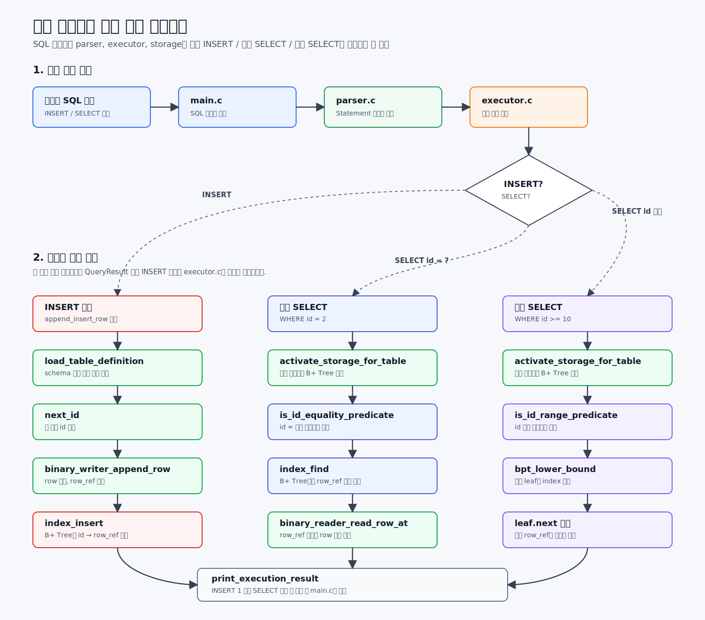

# 요청 흐름으로 보는 전체 아키텍처

이 문서는 프로젝트 전체 흐름을 아주 단순하게 이해하기 위한 문서입니다.

01 문서는 파일 읽는 순서, 02 문서는 함수 호출 흐름, 03 문서는 헤더의 자료구조 이유를 다뤘습니다.
04 문서는 사용자가 실제로 SQL을 입력했을 때 코드가 어떤 순서로 움직이는지 큰 그림만 잡습니다.



## 0. 전체 그림

이 프로젝트는 대략 아래 순서로 움직입니다.

```text
main.c
-> SQL 문자열 확보
-> parser.c에서 SQL 문장을 구조체로 변환
-> executor.c에서 INSERT인지 SELECT인지 판단
-> storage.c에서 실제 파일과 B+ Tree 인덱스를 사용
-> executor.c에서 결과 출력
-> main.c로 돌아와 종료
```

가장 중요한 역할은 이렇게 나뉩니다.

```text
main.c     = 프로그램 시작, 입력 받기, 전체 실행 연결
parser.c   = SQL 문자열을 Statement 구조체로 바꾸기
executor.c = Statement 종류를 보고 실행 함수 고르기
storage.c  = 실제 데이터 저장/조회, B+ Tree 인덱스 사용
common.c   = 문자열 목록, 파일 읽기 같은 공통 도구
```

## 1. 프로그램 시작 흐름

사용자가 프로그램을 실행합니다.

```bash
mini_sql examples/db examples/sql/demo_workflow.sql
```

그러면 가장 먼저 [main](../../../../src/main.c#L437)이 실행됩니다.

```text
main
-> parse_cli_options
-> read_text_file 또는 read_stream_text 또는 run_interactive
-> execute_source_text
```

### 1-1. `main`

`main`은 프로그램의 입구입니다.

하는 일은 단순합니다.

```text
1. 사용자가 어떤 방식으로 실행했는지 확인한다.
2. DB 폴더가 어디인지 확인한다.
3. SQL 파일이 있는지 확인한다.
4. SQL 문자열을 읽는다.
5. execute_source_text에 넘긴다.
```

### 1-2. `execute_source_text`

[execute_source_text](../../../../src/main.c#L118)는 SQL 문자열을 실제 처리 흐름으로 넘기는 중심 함수입니다.

```text
execute_source_text
-> parse_sql_script
-> execute_statement
-> print_execution_result
```

여기서부터 INSERT, 단건 SELECT, 범위 SELECT 흐름이 갈라집니다.

## 2. 사용자가 INSERT를 요청한 경우

예시 SQL:

```sql
INSERT INTO demo.students (name, major, grade) VALUES ('Alice', 'DB', 'A');
```

전체 흐름은 아래와 같습니다.

```text
main.c
-> execute_source_text
-> parser.c의 parse_sql_script
-> parser.c의 parse_insert
-> executor.c의 execute_statement
-> storage.c의 append_insert_row
-> storage.c의 binary_writer_append_row
-> storage.c의 index_insert
-> executor.c의 print_execution_result
-> main.c로 반환
```

### 2-1. main.c: SQL 문자열을 넘긴다

`main.c`는 SQL 파일이나 사용자의 입력을 문자열로 읽습니다.

```text
"INSERT INTO demo.students ..."
```

그리고 이 문자열을 [execute_source_text](../../../../src/main.c#L118)에 넘깁니다.

### 2-2. parser.c: INSERT 문장 구조체를 만든다

`execute_source_text`는 [parse_sql_script](../../../../src/parser.c#L763)를 호출합니다.

`parse_sql_script`는 SQL 문자열을 보고:

```text
이건 INSERT 문장이구나
```

라고 판단한 뒤 [parse_insert](../../../../src/parser.c#L622)를 호출합니다.

`parse_insert`는 SQL 문자열을 아래 같은 구조체로 바꿉니다.

```text
InsertStatement
target  = demo.students
columns = name, major, grade
values  = Alice, DB, A
```

왜 구조체로 바꾸냐면, 저장소는 긴 SQL 문자열보다 이렇게 정리된 정보가 있어야 처리하기 쉽기 때문입니다.

### 2-3. executor.c: INSERT 실행 함수를 고른다

파서가 만든 `Statement`는 [execute_statement](../../../../src/executor.c#L7)로 넘어갑니다.

`execute_statement`는 문장 종류를 봅니다.

```text
STATEMENT_INSERT인가?
-> append_insert_row 호출
```

즉, executor는 직접 저장하지 않고, 저장소 함수로 연결만 합니다.

### 2-4. storage.c: 실제 row를 저장한다

INSERT의 실제 작업은 [append_insert_row](../../../../src/storage.c#L1415)가 합니다.

흐름은 아래와 같습니다.

```text
append_insert_row
-> load_table_definition
-> activate_storage_for_table
-> next_id
-> binary_writer_append_row
-> index_insert
```

각 단계는 이렇게 이해하면 됩니다.

```text
load_table_definition:
  students.schema를 읽어서 컬럼 순서를 확인한다.

activate_storage_for_table:
  students.data를 사용할 준비를 하고, 기존 데이터로 B+ Tree 인덱스를 만든다.

next_id:
  새 row에 붙일 자동 id를 만든다.

binary_writer_append_row:
  row를 바이너리 .data 파일 끝에 저장하고 row_ref를 얻는다.

index_insert:
  id -> row_ref를 B+ Tree에 등록한다.
```

여기서 중요한 부분은 이것입니다.

```text
id가 트리가 되는 것이 아니다.
id가 B+ Tree의 key가 된다.
row_ref가 B+ Tree의 value가 된다.
```

예를 들어 새 row가 이렇게 저장되었다면:

```text
id = 4
row_ref = 120
```

B+ Tree에는 아래 매핑이 들어갑니다.

```text
4 -> 120
```

### 2-5. executor.c: 결과를 출력한다

INSERT가 성공하면 결과는 단순합니다.

```text
INSERT 1
```

[print_execution_result](../../../../src/executor.c#L54)가 이 결과를 출력합니다.

그리고 다시 `execute_source_text`, `main`으로 돌아가서 종료합니다.

## 3. 사용자가 단건 SELECT를 요청한 경우

예시 SQL:

```sql
SELECT name FROM demo.students WHERE id = 2;
```

전체 흐름은 아래와 같습니다.

```text
main.c
-> execute_source_text
-> parser.c의 parse_sql_script
-> parser.c의 parse_select
-> executor.c의 execute_statement
-> storage.c의 run_select_query
-> storage.c의 is_id_equality_predicate
-> storage.c의 run_select_by_id
-> storage.c의 index_find
-> storage.c의 append_row_by_ref
-> storage.c의 binary_reader_read_row_at
-> storage.c의 project_row
-> executor.c의 print_execution_result
-> main.c로 반환
```

### 3-1. parser.c: SELECT 문장 구조체를 만든다

[parse_select](../../../../src/parser.c#L682)는 SQL을 아래처럼 정리합니다.

```text
SelectStatement
source = demo.students
columns = name
where.column = id
where.op = =
where.value = 2
```

### 3-2. executor.c: SELECT 실행 함수를 고른다

[execute_statement](../../../../src/executor.c#L7)는 문장 종류를 보고:

```text
STATEMENT_SELECT인가?
-> run_select_query 호출
```

을 수행합니다.

### 3-3. storage.c: id 단건 조회인지 확인한다

[run_select_query](../../../../src/storage.c#L1546)는 먼저 테이블 정보를 읽고 저장소를 준비합니다.

```text
run_select_query
-> load_table_definition
-> activate_storage_for_table
```

여기서 [activate_storage_for_table](../../../../src/storage.c#L1024)이 중요한 일을 합니다.

```text
1. 바이너리 .data 파일을 준비한다.
2. B+ Tree를 초기화한다.
3. 기존 row들을 읽어서 id -> row_ref 인덱스를 다시 만든다.
```

즉, SELECT를 할 때도 B+ Tree가 준비됩니다.

그 다음 [is_id_equality_predicate](../../../../src/storage.c#L1192)가 실행됩니다.

```text
WHERE id = 숫자인가?
-> 맞으면 run_select_by_id
```

### 3-4. storage.c: B+ Tree에서 row 위치를 찾는다

[run_select_by_id](../../../../src/storage.c#L1246)는 [index_find](../../../../src/storage.c#L348)를 호출합니다.

```text
index_find(id=2)
-> B+ Tree에서 2를 찾음
-> row_ref 반환
```

예를 들어:

```text
2 -> 37
```

이면 `row_ref = 37`을 얻습니다.

### 3-5. storage.c: 파일에서 row 하나만 읽는다

그 다음 [append_row_by_ref](../../../../src/storage.c#L1225)가 `row_ref`를 받아 row를 읽습니다.

```text
append_row_by_ref
-> binary_reader_read_row_at(row_ref)
-> QueryResult에 추가
```

[binary_reader_read_row_at](../../../../src/storage.c#L784)은 `.data` 파일의 특정 byte 위치로 이동해서 row 하나만 읽습니다.

```text
students.data의 37 byte 위치로 이동
-> row 하나 읽기
```

### 3-6. storage.c: 필요한 컬럼만 남긴다

사용자가 `SELECT name`을 요청했기 때문에 전체 row에서 `name` 컬럼만 남겨야 합니다.

이 작업은 [project_row](../../../../src/storage.c#L1155)가 합니다.

마지막으로 `print_execution_result`가 결과 표를 출력하고 종료합니다.

## 4. 사용자가 범위 SELECT를 요청한 경우

예시 SQL:

```sql
SELECT id, name FROM demo.students WHERE id >= 10;
```

전체 흐름은 아래와 같습니다.

```text
main.c
-> execute_source_text
-> parser.c의 parse_sql_script
-> parser.c의 parse_select
-> executor.c의 execute_statement
-> storage.c의 run_select_query
-> storage.c의 is_id_equality_predicate
-> storage.c의 is_id_range_predicate
-> storage.c의 run_select_by_id_range
-> storage.c의 bpt_lower_bound 또는 bpt_leftmost_leaf
-> storage.c의 append_row_by_ref
-> storage.c의 binary_reader_read_row_at
-> storage.c의 project_row
-> executor.c의 print_execution_result
-> main.c로 반환
```

### 4-1. parser.c: WHERE 연산자까지 구조체에 담는다

범위 SELECT는 `WHERE` 연산자가 중요합니다.

```sql
WHERE id >= 10
```

파싱 결과는 이런 느낌입니다.

```text
where.column = id
where.op = WHERE_OP_GREATER_EQUAL
where.value = 10
```

`>=`를 그냥 문자열로 들고 다니지 않고 `WhereOperator` enum으로 바꾸기 때문에, 저장소에서 조건 분기가 쉬워집니다.

### 4-2. storage.c: id 범위 조건인지 확인한다

[run_select_query](../../../../src/storage.c#L1546)는 먼저 단건 id 조건인지 확인합니다.

```text
is_id_equality_predicate
-> WHERE id = 숫자이면 true
```

`id >= 10`은 단건 조건이 아니므로 false입니다.

그 다음 [is_id_range_predicate](../../../../src/storage.c#L1208)를 호출합니다.

```text
WHERE id > 숫자
WHERE id >= 숫자
WHERE id < 숫자
WHERE id <= 숫자
```

중 하나이면 true입니다.

### 4-3. storage.c: B+ Tree leaf를 따라 범위를 읽는다

범위 조회는 [run_select_by_id_range](../../../../src/storage.c#L1260)가 담당합니다.

`WHERE id >= 10` 같은 조건은 먼저 [bpt_lower_bound](../../../../src/storage.c#L108)로 시작 위치를 찾습니다.

```text
B+ Tree에서 10 이상이 처음 나올 수 있는 leaf와 index 찾기
```

예를 들어 leaf가 이렇게 연결되어 있다고 해보겠습니다.

```text
[1 | 5 | 9] -> [12 | 20 | 35] -> [42 | 50 | 60]
```

`id >= 10`이면 시작 위치는 `12`입니다.

```text
12 읽기
20 읽기
35 읽기
leaf.next로 이동
42 읽기
50 읽기
60 읽기
```

이때 각 key마다 저장된 `row_ref`를 꺼내고, `append_row_by_ref`로 실제 row를 읽습니다.

```text
key = 12
row_ref = 300
-> students.data의 300 byte 위치에서 row 읽기
```

`WHERE id <= 50` 같은 조건은 [bpt_leftmost_leaf](../../../../src/storage.c#L88)로 가장 왼쪽 leaf부터 시작합니다.

```text
1, 5, 9, 12, 20, 35, 42, 50까지 읽고
60을 만나면 범위를 벗어나므로 멈춤
```

### 4-4. 결과를 출력하고 종료한다

범위에 맞는 row들이 `QueryResult`에 담기면, `project_row`가 필요한 컬럼만 남깁니다.

마지막으로 [print_execution_result](../../../../src/executor.c#L54)가 표 형태로 출력합니다.

그리고 흐름은 다시 `execute_source_text`, `main`으로 돌아가 종료됩니다.

## 5. 한 번에 보는 세 가지 요청 흐름

### INSERT

```text
사용자 INSERT 입력
-> main.c가 SQL 문자열 확보
-> parser.c가 InsertStatement 생성
-> executor.c가 append_insert_row 선택
-> storage.c가 자동 id 생성
-> storage.c가 row를 바이너리 파일에 저장
-> storage.c가 id -> row_ref를 B+ Tree에 등록
-> executor.c가 INSERT 1 출력
-> 종료
```

### 단건 SELECT

```text
사용자 SELECT WHERE id = 2 입력
-> main.c가 SQL 문자열 확보
-> parser.c가 SelectStatement 생성
-> executor.c가 run_select_query 선택
-> storage.c가 B+ Tree 인덱스 준비
-> storage.c가 id = 숫자 조건 확인
-> storage.c가 B+ Tree에서 row_ref 하나 찾기
-> storage.c가 해당 row 하나 읽기
-> executor.c가 결과 표 출력
-> 종료
```

### 범위 SELECT

```text
사용자 SELECT WHERE id >= 10 입력
-> main.c가 SQL 문자열 확보
-> parser.c가 SelectStatement 생성
-> executor.c가 run_select_query 선택
-> storage.c가 B+ Tree 인덱스 준비
-> storage.c가 id 범위 조건 확인
-> storage.c가 시작 leaf 찾기
-> storage.c가 leaf.next를 따라 row_ref 여러 개 읽기
-> storage.c가 각 row_ref 위치의 row 읽기
-> executor.c가 결과 표 출력
-> 종료
```

## 6. 이 문서에서 기억할 것

가장 중요한 흐름은 이것입니다.

```text
문자열 SQL
-> parser가 구조체로 바꿈
-> executor가 문장 종류를 보고 실행 함수 선택
-> storage가 파일과 B+ Tree를 사용해 실제 처리
-> executor가 출력
```

INSERT에서는:

```text
row 저장 후 id -> row_ref를 B+ Tree에 넣는다.
```

단건 SELECT에서는:

```text
B+ Tree에서 id 하나로 row_ref 하나를 찾는다.
```

범위 SELECT에서는:

```text
B+ Tree에서 시작 leaf를 찾고 leaf.next를 따라 여러 row_ref를 읽는다.
```

한 문장으로 요약하면:

```text
이 프로젝트는 SQL 문자열을 구조체로 바꾼 뒤, storage.c에서 바이너리 파일과 B+ Tree 인덱스를 이용해 INSERT와 SELECT를 처리한다.
```
